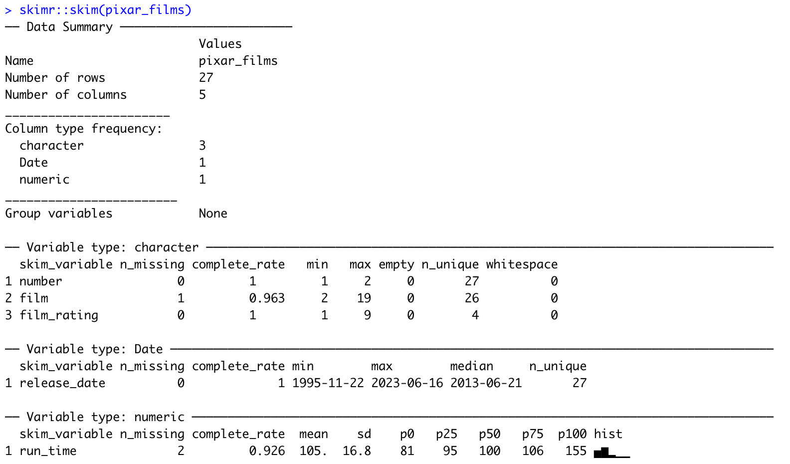
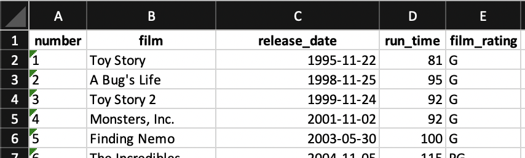

<style type="text/css">
.remark-code {
    font-size: 12px;
}
.font17 {
    font-size: 17px;
}
.font14 {
    font-size: 14px;
}
</style>


# Explore, write, read, create data

* Explore data
* Write data
* Read data
* Create data
* Other data sources

---

# Explore data

```{r, eval = TRUE}
# install.packages("pixarfilms")
options(tidyverse.quiet = TRUE)
library(tidyverse)
library(pixarfilms)
```

The package {pixarfilms} loads 5 datasets, we'll use 1 in this lesson: `pixar_films`

---

# Explore data

Exercise!

Look at the `pixar_films` dataset

* print it
* call `View()` on it
* use `glimpse()`
* install {skimr} and use `skim()` on the data

What is the advantage of each of those ?

???
For exercises and examples we'll use toy data set about pixar films provided by
the package pixarfilms, it contain 5 tables, take a couple minutes tom explore
them and tell us what data types you find there. Simply printing a dataset
is a fair way of getting aquainted with the data, `glimpse()` is sometimes 
a useful alternative, `{skimr}` is not a tidyverse package but it's too good
to ignore!

---

# Explore data


```{r}
pixar_films
```

---


# Explore data

```{r}
# from {tibble} package, loaded by {tidyverse}
glimpse(pixar_films)
```

---


# Explore data

```{r, eval=FALSE}
# from {skimr} package, not a tidyverse package!
library(skimr)
skim(pixar_films)
```



---

# Write data

What do you think those do ?

 * `readr::write_csv(x, file)`
 * `readr::write_tsv(x, file)`
 * `readr::write_delim(x, file, delim)`
 * `writexl::write_xlsx(x, path)`

--

Exercise!

 * Save pixar_films to a csv file
 * Save the whole set of 5 tables to an xlsx file
 * Open these files and look at the result
 * Where are the data types ?
 
???
 Usually we start analysis by getting data from somewhere, this data might come
 directly from a database but very often it will come from files, and these
 files will often be .csv or excel file. Here we'll do it in reverse and we'll
 write the files first and learn to read them back. readr (already loaded with tidyverse),
 readxl and writexl are the packages we'll need.
 
---

# Write data 

```{r}
readr::write_csv(x = pixar_films, file = "pixar_films.csv")
writexl::write_xlsx(x = list(pixar_films = pixar_films), path = "pixar_films.xlsx")
```

```{r, eval = FALSE}
# bonus tricks to open files from R!
file.edit("pixar_films.csv")
browseURL("pixar_films.xlsx")
```

.pull-left[
```
number,film,release_date,run_time,film_rating
1,Toy Story,1995-11-22,81,G
2,A Bug's Life,1998-11-25,95,G
3,Toy Story 2,1999-11-24,92,G
4,"Monsters, Inc.",2001-11-02,92,G
5,Finding Nemo,2003-05-30,100,G
...
```
]

.pull-right[

]
 
---
layout: true
class: .font14

# Read data

---

What do you think those do ?

* `readr::read_csv(file)`
* `readr::read_tsv(file)`
* `readxl::read_excel(path, sheet)`
 
---

Exercise!

* Read the csv file that we saved back into `pixar_films_from_csv`
* Read the excel file that we saved back into `pixar_films_from_xlsx`
* Look at the output displayed by `readr::read_csv()`
* Look at the data types
* Did we reproduce the original ?

---

```{r}
pixar_films_from_csv <- readr::read_csv("pixar_films.csv")
```

---

```{r}
pixar_films_from_csv
```

---

```{r}
pixar_films_from_xlsx <- readxl::read_excel("pixar_films.xlsx", "pixar_films")
pixar_films_from_xlsx
```

---

```{r}
waldo::compare(
  pixar_films,
  pixar_films_from_csv
)
```

???
the "number" column, which was stored as a character, was imported as numeric
the function checks the first 1000 rows and try to make the best guess, usually it's
good enough!

---

```{r}
waldo::compare(
  pixar_films,
  pixar_films_from_xlsx
)
```

???
Excel recognized the char col and the date, but we got back a date-time object
rather than a date!

---

```{r}
pixar_films_from_csv <- readr::read_csv("pixar_films.csv")

spec(pixar_films_from_csv)
```

---

```{r}
pixar_films_from_csv <- readr::read_csv("pixar_films.csv", col_types = cols(
  number = col_character(), # we changed to keep it as character like in the original data
  film = col_character(),
  release_date = col_date(format = ""),
  run_time = col_double(),
  film_rating = col_character()
))
```


???
As we see types have been guessed.
 Were they guessed right ? This output is helpful the first time,
 but we don't want to clutter the output of our scripts! Try to make the message
 quieter using the given recommendations.

---

Exercise!

Take a look at `?read_excel`

What are the following arguments for and what could be a situation to use them?

* `col_names`
* `range`
* `skip`
* `na`

Check the default for `na` in `read_excel` vs `read_csv`, what do you see ?

---
layout: false

# Create data 

Create data with `tibble()`

```{r}
library(lubridate) # to use `as_date()`
people <- tibble(
  name = c("Helen", "John", "Julia"),
  age = c(32, 30, 27),
  birthday = as_date(c("2022-03-26", "2022-08-15", "2022-06-03"))
  )
people
```

---

# Create data 

Creating data with `tribble()`

```{r}
library(lubridate) # to use `as_date()`
people2 <- tribble(
  ~name,   ~age, ~birthday,
  "Helen", 32,   as_date("2022-03-26"), 
  "John",  30,   as_date("2022-08-15"),
  "Julia", 27,   as_date("2022-06-03")
  )
people2

identical(people, people2)
```

---

# Other data formats

* RDS file : `read_rds()` and `write_rds()` from {readr}
* data bases : {dbplyr} package
* json : {jsonlite} package
* xml : {xml2} package
* sas, stata, spss files : {haven} package

---

# Reading and writing correctly is important!

* Good reading
  * No data loss
  * No awkward transformation to fix what wasn't broken!
* Good writing
  * No spoiling your good work
  * Easy good reading!
  * Less opportunity for error by collaborators down the line
  
???
Good writing is straightforward if we use the functions above, issues often come from other
systems. Good reading is harder.
90% of weird transformations you need to fix data you just read are possible
through the reading function, skip rows, take only a selection of column or a range,
consider this value as missing... take the time to read the doc in those cases.
