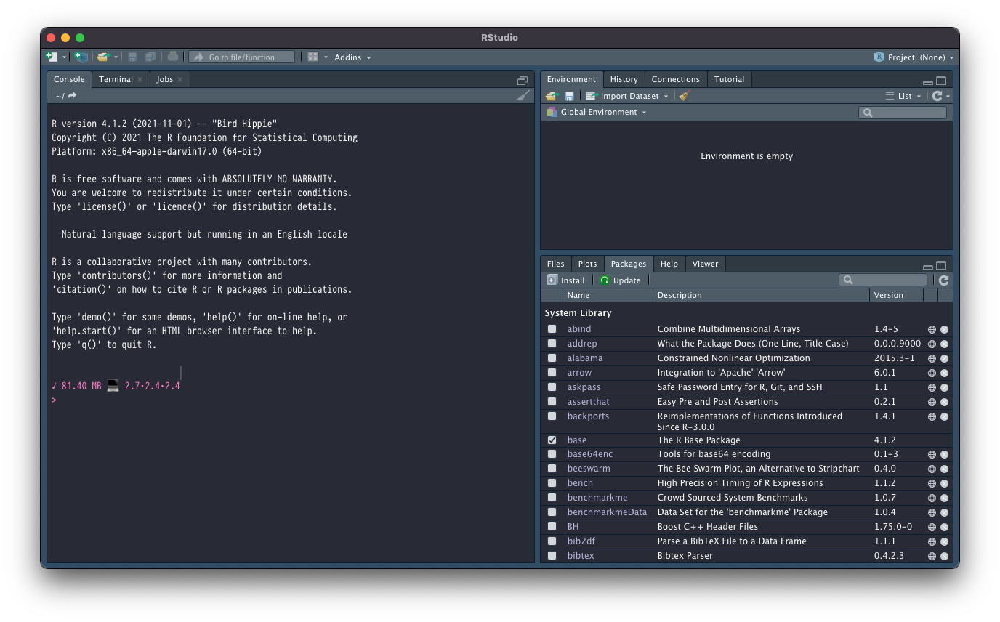
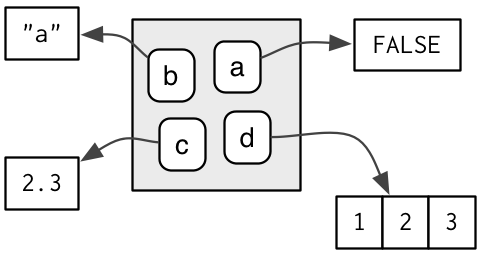

<style type="text/css">
.pull-left {
  margin-top: -25px;
}
.pull-right {
  margin-top: -25px;
}
.remark-code {
    font-size: 12px;
}
.font17 {
    font-size: 17px;
}
.font14 {
    font-size: 14px;
}
</style>

# Introduction

Organization of half-day R courses:

- Intro courses:
  * Tidyverse intro I
  * Base R intro/Tidyverse intro II (this course)
  * Data visualization I
  * Data visualization II
- Advanced courses:
  * Advanced tidyverse (this afternoon)
  * R package creation
  * Working with database systems
  * Parallelization & efficient R programming
  * Advanced topics (tbd)

---

# Course material

Our course material currently is available from Github at

https://github.com/cynkra/bag-courses

Today we will be looking at the folder `1-2_intro_tidy-ii`


---

# General remarks

- Even though we are starting out remotely, we hope for these courses to be interactive: go ahead and ask if something is unclear!
- You can also write into the chat, which I will try to monitor when Antoine is presenting.
- We were asked to provide recordings of the courses for those of you who cannot join, so recording is activated.
- Per course unit, we offer 4 hours of follow up time; approach us with questions (nicolas@cynkra.com)!

---

# RStudio Intro



---

# Assignment in R

Assignment means we *bind* a *value* to a *name* in an *environment*.

.pull-left[
```{r}
a <- FALSE
b <- "a"
c <- 2.3
d <- c(1, 2, 3)
```
]

.pull-right[
```{r, echo = FALSE, out.width = "50%", fig.align = "center"}

```
]

The assignment operator `<-` performs this *binding* in the current environment, here the global environment (`.GlobalEnv`).

.pull-left[
```{r, eval = FALSE}
0a <- 1
```
```
## Error: unexpected symbol in "0a"
```
]

.pull-right[
```{r, eval = FALSE}
if <- 1
```
```
## Error: unexpected assignment in "if <-"
```
]

There are some rules as to what names are permissible.

---

# Retrieving values

A value can be accessed via its name (not a string!).

.pull-left[
```{r}
a
```
]

.pull-right[
```{r}
b
```
]

(If it is accessible from the current environment.)

```{r, eval = FALSE}
some_crazy_name
```
```
## Error: object 'some_crazy_name' not found
```

Bindings in an environment can be listed using `ls()`.

.pull-left[
```{r}
ls()
```
]

.pull-right[
```{r}
ls(envir = new.env())
```
]

---

# What objects are accessible?

.pull-left[
```{r}
ls()
```
]

.pull-right[
```{r}
mean
```
]

```{r, include = FALSE}
width <- options(width = 50)
```

.pull-left[
```{r}
search()
```
]

.pull-right[
```{r}
library(readr)
search()
```
]

```{r, include = FALSE}
options(width)
```

```{r, echo = FALSE, out.width = "75%", fig.align = "center"}
knitr::include_graphics("search-path.png")
```

---

# Base R vector classes I

The function `c()` can be used to combine objects, such as literals.

```{r}
x_log <- c(TRUE, FALSE)     # same as c(T, F)
x_int <- c(1L, 2L, 3L)      # use 1L to enforce integer, rather than numeric
x_num <- c(1, 2, 6.3, 0.12) # also called 'double'
x_chr <- c("Hello World")   # or 'Hello World'
```

We can check the type using `class()` and the length with `length()`.

.pull-left[
```{r}
class(x_log)
class(c(x_int, x_chr))
```
]

.pull-right[
```{r}
length(x_chr)
length(c(x_int, x_chr))
```
]

There is no type distinction between scalar and vector values!

???
There is a certain order in the list above: `logical` is the least flexible
type, while `character` is the most flexible. If you combine vectors of
different type, the more flexible class will win

---

# Base R vector classes II

The class of a vector can safely be changed to a more "general" type.

.pull-left[
```{r}
as.logical(c(1, 0, 2))
as.integer(c(TRUE, FALSE, TRUE))
```
]

.pull-right[
```{r}
as.numeric(c("1", "2"))
as.character(c(TRUE, FALSE))
```
]

A change to a more "specific" general type is also possible.

```{r}
as.numeric(c("hi", "number", "1"))
```

???
These functions will always work if you coerce towards greater flexibility.
If you want to go the other way, it may give you `NA`s and some warnings.

---

# Sequences & repetitions

Often we need to create vectors with patterns, such as sequences

.pull-left[
```{r}
1:5
seq(1, 5)
```
]

.pull-right[
```{r}
seq(3, 9, by = 2)
seq(0, 1, length.out = 5)
```
]

or repetitions

.pull-left[
```{r}
rep(5, 4)
rep("hello", 2)
```
]

.pull-right[
```{r}
rep(1:4, 2)
rep(1:4, each = 2)
```
]

---

# Basic arithmetic

Operators `+`, `-`, `*`, `/`, etc. are implemented as functions

.pull-left[
```{r}
2 + 3
```
]

.pull-right[
```{r}
`+`(2, 3)
```
]

Operations are vectorized (element-wise)

.pull-left[
```{r}
x <- c(1, 2,  4)
x +  c(5, 0, -1)

1:5 * 2
```
]

.pull-right[
```{r}
x <- c(1, 2,  4)
x *  c(5, 0, -1)

1:5 * rep(2, 5)
```
]

---

# Recycling

In case of length mismatch, the shorter vector is recycled.

.pull-left[
```{r}
c(1, 2) + c(6, 0, 9, 20, 22, 11)
```
]

.pull-right[
```{r}
c(1, 2, 1, 2, 1, 2) + c(6, 0, 9, 20, 22, 11)
```
]

```{r}
c(1, 2, 3, 4) + c(6, 0, 9, 20, 22, 11)
```

Advice: in general, try to avoid beyond recycling length 1 vectors.

---

# Comparison operators

.pull-left[
```{r}
x <- c(1, 2, 4, 2)
```
]

.pull-right[
```{r}
y <- c(2, 2, 4, 5)
```
]

Inequality: `<`, `>`, `<=`, `>=`

.pull-left[
```{r}
x < 2
x < y
```
]

.pull-right[
```{r}
x <= 2
x <= y
```
]

Equality (and its negation): `==`, `!=`

.pull-left[
```{r}
x == y
```
]

.pull-right[
```{r}
x != y
```
]

---

# Logical operators

.pull-left[
```{r}
a <- x >= 2
a
```
]

.pull-right[
```{r}
b <- x < 4
b
```
]

Boolean operators: `&` (AND) or `|` (OR), `!` (NOT)

.pull-left[
```{r}
a & b
a | b
```
]

.pull-right[
```{r}
!a & b
!(a & b)
```
]

We also have `&&` and `||` (not discussed here)

---

# Numeric indexing

.pull-left[
```{r}
x <- c(1.2, 3.9, 0.4, 0.12)
```
]

.pull-right[
```{r}
i <- 3:4
```
]

We can extract values from a vector, using a numeric index.

.pull-left[
```{r}
x[c(1, 3)]
x[c(1, 1, 3)]
x[-1]
```
]

.pull-right[
```{r}
x[2:3]
x[i]
x[-i]
```
]

---

# Logical indexing

.pull-left[
```{r}
x <- c(1.2, 3.9, 0.4, 0.12)
x
```
]

.pull-right[
```{r}
(i <- rep(c(TRUE, FALSE), each = 2))
```
]

We can extract values from a vector, using a logical index.

.pull-left[
```{r}
x[i]
x[!i]
x[x > 2]
```
]

.pull-right[
```{r}
x[TRUE]
x[FALSE]
x[-i]
```
]

???
last example: complete craziness! `-i` evaluates to `c(-1, -1, 0, 0)`, which selects all but the first element and adds nothing to this

---

# Subset assignment

Combines a subsetting operation with an assignment.

```{r}
y <- c(1.2, 3.9, 0.4, 0.12)

y[c(2, 4)] <- 5
y[c(FALSE, TRUE, FALSE, TRUE)] <- 5
y

y[y > 2] <- 2
y

y[y == 2] <- c(4, 5)
y
```

---

# Exercises (Homework)

1. Create a vector called `v1` containing the numbers 2, 5, 8, 12 and 16.
1. Extract the values at positions 2 and 5 from `v1`.
1. Use `x:y` notation to make a second vector called `v2` containing the
numbers 5 to 9.
1. Subtract `v2` from `v1` and look at the result.
1. Generate a vector with 1000 standard-normally distributed random numbers
(use `rnorm()`). Store the result as `v3`. Extract the numbers that are
bigger than 2.

---

# Solutions I

1. Create a vector called `v1` containing the numbers 2, 5, 8, 12 and 16.

```{r}
v1 <- c(2, 5, 8, 12, 16)
```

1. Extract the values at positions 2 and 5 from `v1`.

```{r}
v1[c(2, 5)]
```

1. Use `x:y` notation to make a second vector called `v2` containing the
numbers 5 to 9.

```{r}
v2 <- 5:9
```

---

# Solutions II

1. Subtract `v2` from `v1` and look at the result.

```{r}
v1 - v2
```

1. Generate a vector with 1000 standard-normally distributed random numbers
(use `rnorm()`). Store the result as `v3`. Extract the numbers that are
bigger than 2.

```{r}
v3 <- rnorm(1000)
v3[v3 > 2]
```

---

# Matrices

Internally represented by a column-major vector, with dimensions.

.pull-left[
```{r}
(m <- matrix(c(1, 4, 2, 2, 7, 3), nrow = 2))
```
]

.pull-right[
```{r}
dim(m)
```
]

Two indexes are required for subset selection.

.pull-left[
```{r}
m[1, 2]
m[, c(2, 3)]
```
]

.pull-right[
```{r}
m[1, ]
m[1, , drop = FALSE]
```
]

---

# Exercises (Homework)

1. Create a 10 x 10 matrix that contains a sequence of numbers (use the `:`
notation).
1. Extract the 2. column of the matrix.
1. Extract the 5. row of the matrix.
1. Extract the 5. and the 6. row of the matrix.
1. Compare the classes of the results to the previous two subsetting operations.
1. Modify 3., so that it returns the same class as 4.

---

# Solutions I

1. Create a 10 x 10 matrix that contains a sequence of numbers (use the `:`
notation).

```{r}
mat <- matrix(1:100, ncol = 10)
```

1. Extract the 2. column of the matrix.

```{r}
mat[, 2]
```

1. Extract the 5. row of the matrix.

```{r}
v1 <- mat[5, ]
```

---

# Solutions II

1. Extract the 5. and the 6. row of the matrix.

```{r}
v2 <- mat[c(5, 6), ]
```

1. Compare the classes of the results to the previous two subsetting operations.

```{r}
class(v1)
class(v2)
```

---

# Solutions III

1. Modify 3., so that it returns the same class as 4.

```{r}
(v3 <- mat[5, , drop = FALSE])
class(v3)
```

---

# Lists

.pull-left[
```{r}
(x <- list(u = c(2, 3, 4), v = "abc"))
```
]

.pull-right[
```{r}
length(x)
```
]

Subsetting can be done with `$`, `[` or `[[`

.pull-left[
```{r}
x$u
x[["u"]]
x[[1]]
```

]

.pull-right[
```{r}
x["u"]
x[1:2]
```
]

---

# List subsetting mnemonic

```{r, echo = FALSE, out.width = "75%", fig.align = "center"}
knitr::include_graphics("lists.png")
```

.pull-left[
```{r}
(x <- list(list(1:3), list(4:6)))
```

]

.pull-right[
```{r}
x[[1]][[1]]
x[[1]][[1]][1]
```
]

---

# Names

.pull-left[
```{r}
(x <- list(u = c(2, 3, 4), v = "abc"))
```
]

.pull-right[
```{r}
names(x)
```
]

Any vector in R can have a names attribute.

.pull-left[
```{r}
(y <- c(a = 1, b = 2, c = 3))
class(y)
```
]

.pull-right[
```{r}
y[c("a", "b")]
```
]

---

# Data frames

2-dimensional like matrices, but implemented using lists

```{r}
(d <- data.frame(kids = c("Jack", "Jill", "Jamie"), ages = c(12, 10, 7)))
```

.pull-left[
```{r}
d[["ages"]] # same as d$ages
d[1, ]
d[, 1]
```
]

.pull-right[
```{r}
length(d) # same as ncol(d)
nrow(d)
dim(d)
```
]

---

# Exercises (Homework)

1. Generate two random vectors of length 10 (for example using `runif()`), `a`, and `b`. Combine them in a list, call it `l1`.
1. Compare the classes of `l1[2]` and `l1[[2]]`. Can you explain the
difference?
1. How many rows does the data frame `mtcars` contain? The dataset is available by default. Just try typing `mtcars`.
1. Of what type is the column `vs` of `mtcars`.
1. Try printing the column names of `mtcars`.

---

# Solutions I

1. Generate two random vectors of length 10 (for example using `runif()`), `a`, and `b`. Combine them in a list, call it `l1`.

```{r}
a <- runif(10)
b <- runif(10)
l1 <- list(a, b)
```

1. Compare the classes of `l1[2]` and `l1[[2]]`. Can you explain the
difference?

.pull-left[
```{r}
class(l1[2])
```
]

.pull-right[
```{r}
class(l1[[2]])
```
]

Subsetting a list using `[`, will return a list, whereas using `[[`, the object contained in the list at the given position is returned.

---

# Solutions II

1. How many rows does the data frame `mtcars` contain? The dataset is available by default. Just try typing `mtcars`.

```{r}
nrow(mtcars)
```

1. Of what type is the column `vs` of `mtcars`.

```{r}
class(mtcars$v2)
```

1. Try printing the column names of `mtcars`.

```{r}
colnames(mtcars)
```
