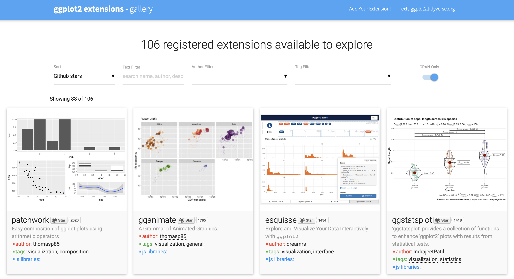

<style type="text/css">
.remark-code {
    font-size: 12px;
}
.font17 {
    font-size: 17px;
}
.font14 {
    font-size: 14px;
}
</style>

```{r setup, include=FALSE}
knitr::opts_chunk$set(fig.height = 4, cache = TRUE, message = FALSE, warning = FALSE)
```

# Basics for visualisation in R using {ggplot2}

* {ggplot2} is the most used R visualization package
* "gg" stands for the "grammar of graphics"
* It is shipped with {tidyverse}

```{r}
library(tidyverse)
```

???

In the {tidyverse} the standard package for visualization is {ggplot2}.
The functions of this package follow a quite unique logic (the "grammar of graphics") and therefore require a special syntax.
In this section we want to give a short introduction, how to get started with {ggplot2}.

---

# Grammar of graphics

* Grammar: A set of structural rules which help define and establish the component of a language
* Grammar of graphics : framework to describe the components of any graphics

With ggplot we don't create a plot just by calling a `scatter_plot()` or a `histogram()`
function that would have different arguments.

A more general approach means there's a learning curve, but it pays off!

---

# Our dataset


```{r}
mpg
```

* displ : engine displacement, in litres
* cyl : number of cylinders
* hwy : highway miles per gallon

<!-- * trans: type of transmission -->
<!-- * drv: type of drive train, f = front-wheel drive, r = rear wheel drive, 4 = 4wd -->
<!-- * cty : city miles per gallon -->
<!-- * fl : fuel type -->
<!-- * class : "type" of car -->

---

# Creating the plot skeleton

`ggplot()` is used to set up the chart, but can't be used alone
to create a useful visualization

1. Choose dataset (argument `data`)
2. Map variables to visual properties (argument `mapping`)
3. Create a "ggplot" object that can be enhanced to display a useful chart when it's
printed

```{r, eval = FALSE}
ggplot(data = mpg, mapping = aes(x = displ, y = hwy))
```

---

# Creating the plot skeleton

We map `displ` to the `x` coordinate, and `hwy` to the `y` coordinate,
but we haven't mentioned what we want to see yet!

```{r}
ggplot(mpg, aes(x = displ, y = hwy))
```

???

This created only an empty plot, because we did not tell {ggplot2} which geometry we want to use to display the variables we set in the `ggplot()` call.
We do this by adding (with the help of the `+` operator after the `ggplot()`-call) a different function starting with `geom_` to provide this information.

---

# Adding a layer

To create a useful chart we need to add layers

* There are different types of layers
* Layers are added using the `+` operator
* `geom_point()` creates a scatter plot layer

```{r, eval = FALSE}
ggplot(mpg, aes(x = displ, y = hwy)) +
  geom_point()
```

???

This is maybe the most basic plot you can create.
To map a different variable than `disp` to the x-axis, change the respective variable name in the `aes()` argument.

---

# Adding a layer

```{r}
ggplot(mpg, aes(x = displ, y = hwy)) +
  geom_point()
```

???

This is maybe the most basic plot you can create.
To map a different variable than `disp` to the x-axis, change the respective variable name in the `aes()` argument.

---

# Teaser #1

We have more aesthetics!

```{r}
ggplot(mpg, aes(x = displ, y = hwy, color = drv)) +
  geom_point()
```

---

# Teaser #2

We can combine "geom" layers

```{r, message=FALSE}
ggplot(mpg, aes(x = displ, y = hwy, color = drv)) +
  geom_point() +
  geom_smooth()
```

---

# Teaser #3

And we can do much more!

```{r, message=FALSE}
ggplot(mpg, aes(x = displ, y = hwy, color = drv)) +
  geom_point() +
  geom_smooth(se = FALSE) +
  facet_wrap(vars(drv)) +
  theme_bw() +
  ggtitle("Highway miles per gallon vs engine displacement",  "for different drive train types")
```

???

Always good to have: The *ggplot2* cheatsheet (https://github.com/rstudio/cheatsheets/blob/master/data-visualization-2.1.pdf).

<!-- --- -->

<!-- # Terminology -->

<!-- - **Data:** The data to visualize -- consists of variables and observations. -->

<!-- - **Geoms:** Geometric objects which represent the data (points, lines, polygons, etc.). -->

<!-- - **Mappings:** Match variables with aesthetic attributes of the (geometric) objects. -->

<!-- - **Scales:** Mapping of the "data units" to "physical units" of the geometric objects (e.g. length, diameter or color); defines the _legend_. -->

<!-- - **Coord:** System of coordinates, mapping of the data to a two dimensional plain of the graphic; defines the _axes_ and _grid_. -->

<!-- - **Stats:** Statistical transformation of the data (5 point summary, classification, etc.). -->

<!-- - **Facetting:** Division and illustration of data subsets, also known as "Trellis" images. -->

---

# `geom_*` functions

"geom" = geometric object, see documentation : https://ggplot2.tidyverse.org/reference/#section-layer-geoms

```{r}
ls("package:ggplot2", pattern = "^geom_")
```

---

# `geom_*` functions

The most popular ones are

- `geom_point()`
- `geom_line()`
- `geom_bar()`
- `geom_col()`
- `geom_histogram()`
- `geom_boxplot()`
- `geom_text()` / `geom_label()`

---

# `geom_point()`

We know a bit about it now, we'll use it to show case some features that can
be generalized to other features.

---

# `geom_point()`

In `?geom_point` we find which aesthetics are available : 

- `x`
- `y`
- `alpha`
- `colour` (or `color`)
- `fill`
- `group`
- `shape`
- `size`
- `stroke`

---

# `geom_point()`

We can run `vignette("ggplot2-specs")` to know more about them, the main ones are:

- `x` (required) : horizontal coordinate
- `y` (required) : vertical coordinate
- `colour` (or `color`) : color of contour or point
- `shape` : shape of the point
- `size` : size of the point
- `alpha` : opacity (low = more transparent)

---

# `geom_point()`

`color`

We can use a constant value for these aesthetics if we provide it in the geom
function.

```{r}
ggplot(mpg, aes(x = displ, y = hwy)) +
  geom_point(color = "red")
```

---

# `geom_point()`

`color`

To map a variable to an aesthetics we use `aes()` in the `mapping` argument of
`ggplot()`

```{r}
ggplot(mpg, aes(x = displ, y = hwy, color = drv)) +
  geom_point()
```

---

# `geom_point()`

`color` can also take a continuous value

```{r}
ggplot(mpg, aes(x = displ, y = hwy, color = cty)) +
  geom_point()
```

---

# `geom_point()`

`shape` should be mapped to a discrete variable

```{r}
ggplot(mpg, aes(x = displ, y = hwy, color = drv, shape = drv)) +
  geom_point()
```

---

# `geom_point()`

but `shape` can also be defined with the same symbol for all points in the plot

```{r}
ggplot(mpg, aes(x = displ, y = hwy, color = drv)) +
  geom_point(shape = "triangle") # we can also provide an integer value
```

---

# `geom_point()`

`size` should be mapped to a continuous variable

```{r}
ggplot(mpg, aes(x = displ, y = hwy, color = drv, size = cty)) +
  geom_point()
```

---

# `geom_point()`

but it can also be defined with an specific `size` for all points in the plot

```{r}
ggplot(mpg, aes(x = displ, y = hwy, color = drv)) +
  geom_point(size = 8)
```

---

# `geom_point()`

`alpha` is most useful when set as a constant, to improve visualizations
when overplotting

```{r}
ggplot(mpg, aes(x = displ, y = hwy, color = drv)) +
  geom_point(size = 8, alpha = 0.3)
```

---

# `geom_point()`

`geom_*()` functions have a `position` argument to adjust the position.
A common use for `geom_point()` is `position = "jitter"`, also good to handle
overplotting!

```{r}
ggplot(mpg, aes(x = displ, y = hwy, color = drv)) +
  geom_point(position = "jitter")
```

---

# `geom_point()`

`position = "jitter"` and `position = position_jitter()` are equivalent,
but `position_jitter()` offers more control through arguments

```{r}
ggplot(mpg, aes(x = displ, y = hwy, color = drv)) +
  geom_point(position = position_jitter(width = .5, height = .5))
```

---

# Exercise

Using the `iris` dataset available in R by default and the knowledge from the previous slides, create a scatter plot using 2 numeric columns, and use `Species` as a color. You can use the pattern we used above.

```{r}
ggplot(mpg, aes(x = displ, y = hwy, color = drv)) +
  geom_point()
```

---

# `geom_line()`

using `?geom_line` we find which aesthetics are available, the main ones are:

- `x` (required) : horizontal coordinate
- `y` (required) : vertical coordinate
- `alpha` : opacity (low = more transparent)
- `colour` (or `color`) : color of the line
- `linetype` : type of the line
- `size` : size of the line

---

# `geom_line()`

`color` and `linetype`

We can use a constant value for these aesthetics if we provide it in the geom function.

```{r}
ggplot(mpg, aes(x = displ, y = hwy)) +
  geom_line(color = "red", linetype = "dotdash")
```

you can see the different line types using `?linetype`

---

# `geom_line()`

`linetype` should be mapped to a discrete variable

```{r}
ggplot(mpg, aes(x = displ, y = hwy, linetype = drv)) +
  geom_line()
```


---
# `geom_line()`

using `size` you can change how thick are the lines

```{r}
ggplot(mpg, aes(x = displ, y = hwy, linetype = drv)) +
  geom_line(size=2)
```

---

# `geom_line()`

Exercise :

Using the `economics` dataset available in R by default and the knowledge from the previous slides, draw a plot using `geom_line` and different aesthetics mapped to variables. Change the color and use a dashed linetype.

---

# `geom_bar()`

using `?geom_bar` we find which aesthetics are available, the main ones are:

you should use only one coordinate `x` or `y`

- `x` : use it to create vertical bars
- `y` : use it to create horizontal bars
- `fill` : define bar colors
- `alpha` : opacity (low = more transparent)

---

# `geom_bar()`

`fill` should be mapped to a discrete variable. When the coordinate (`x` or `y`) and `fill` are using the *same* variable each category has its own color.

```{r}
ggplot(mpg, aes(x = drv, fill = drv)) +
  geom_bar()
```

---

# `geom_bar()`

When the coordinate (`x`or `y`) and `fill` are using a *different* variable, each bar represents the distribution of the variable used in `fill` for each category of the coordinate (`x`or `y`), creating stacked bars.

```{r}
ggplot(mpg, aes(x = drv, fill = class)) +
  geom_bar()
```

---

# `geom_bar()`

`geom_bar()` is often used with `position = "dodge"` (equivalent to `position = position_dodge()`), and this parameter changes the plot from stacked bars to clustered bars.

```{r}
ggplot(mpg, aes(x = drv, fill = class)) +
  geom_bar(position = "dodge")
```

---

# `geom_bar()`

`position = "fill"` is useful too!

```{r}
ggplot(mpg, aes(x = drv, fill = class)) +
  geom_bar(position = "fill")
```

---

# `geom_bar()`

Exercise :

Using the `diamonds` dataset and the knowledge from the previous slides, draw a barplot using different aesthetics mapped to variables. Use different positions to compare the plots.


---

<!-- Probably it needs more explanation to understand the difference between geom_bar and geom_col -->

# `geom_col()`

```{r}
df <- data.frame(category = c("a", "b", "c"), value = c(2.3, 1.9, 3.2))
ggplot(df, aes(x = category, y = value)) +
  geom_col(fill = "darkblue")
```

---

# `geom_histogram()`

.pull-left[

```{r}
ggplot(mpg, aes(x = displ)) +
  geom_histogram(fill = "darkblue", bins = 10)
```

]
  
  .pull-right[

```{r}
ggplot(mpg, aes(x = displ, fill = drv)) +
  geom_histogram(bins = 10)
```

  ]

---

# `geom_boxplot()`

`geom_boxplot()` needs one variable to be of class `character` or `factor` (better) to initiate the grouping.

```{r}
ggplot(mpg, aes(x = class, y = displ)) +
  geom_boxplot()
```

---

# `geom_text()`/`geom_label()`

These work a lot like `geom_point()`, but with the added aesthetic `label`

```{r, message = FALSE}
avgs <-
  mpg %>% 
  group_by(drv) %>% 
  summarize(displ = mean(displ), hwy = mean(hwy))

ggplot(avgs, aes(x = displ, y = hwy, label = drv, color = drv)) +
  geom_label()
```

---

# `geom_text()`/`geom_label()`

These work a lot like `geom_point()`, but with the added aesthetic `label`

```{r, message = FALSE}
avgs <-
  mpg %>% 
  group_by(drv) %>% 
  summarize(displ = mean(displ), hwy = mean(hwy))

ggplot(avgs, aes(x = displ, y = hwy, label = drv)) +
  geom_text(color = "black")
```

---

# Legend, and labels

Using `labs` you can set the title/subtitle and also add a caption and a tag.

.pull-left[

```{r, eval=FALSE}
ggplot(
  data = mpg,
  mapping = aes(x = displ, y = hwy, color = class)
) +
  geom_point() +
  labs(
    x = "Displacement",
    y = "Highway mileage\n[miles per gallon]",
    color = "Car class",
    title = "Highway mileages depending on displacement",
    subtitle = "By car class"
  )
```
]

--

  .pull-right[
```{r, echo=FALSE}
ggplot(
  data = mpg,
  mapping = aes(x = displ, y = hwy, color = class)
) +
  geom_point() +
  labs(
    x = "Displacement",
    y = "Highway mileage\n[miles per gallon]",
    color = "Car class",
    title = "Highway mileages depending on displacement",
    subtitle = "By car class"
  )
```
  ]

---

# Legend, and labels

Exercise :

Using the `iris` dataset and the knowledge from the previous slides, draw a boxplot using different aesthetics mapped to variables, and also change the labels and title.


---

# Axis

There is a plethora of `scale_...()` functions available, which influence the axes. For example there is a function to change the scale of an axis to a logarithmic scale.

.pull-left[

```{r, eval=FALSE}
ggplot(
  data = mpg,
  mapping = aes(x = displ, y = hwy, color = class)
) +
  geom_point() +
  scale_x_log10()
```
]

  .pull-right[
```{r, echo=FALSE}
ggplot(
  data = mpg,
  mapping = aes(x = displ, y = hwy, color = class)
) +
  geom_point() +
  scale_x_log10()
```
  ]


---

# Facetting

“Facetting” denotes an idea of dividing a graphic into sub-graphics based on the (categorical) values of one or more variables of a dataset. Therefore, each sub-graphic shows a plot for a subset of the data.

To implement it you can use two options:

.pull-left[
```{r, eval=FALSE}
facet_grid(facets = vars(<variable>), 
           scales = "fixed", 
           ...)

facet_wrap(rows = vars(<variable>), 
           cols = vars(<variable>), 
           scales = "fixed", 
           ...)
```
]

  .pull-right[

]

---

#  `face_wrap*` function

with `?face_wrap` we can find the different arguments to change our plot.

- `facets` (required) : set of categorical variables
- `dir` : `"h"` (default) for horizontal, or `"v"`, for vertical orientation.
- `nrow` or `ncol` : 	Number of rows and columns.

---

#  `face_wrap*` direction

.pull-left[
```{r}
ggplot(mpg, aes(displ, hwy)) +
  geom_point(aes(colour = drv)) +
  facet_wrap(vars(year))
```
]

  .pull-right[
```{r}
ggplot(mpg, aes(displ, hwy)) +
  geom_point(aes(colour = drv)) +
  facet_wrap(vars(year), dir = "v")
```
]

---

#  `face_wrap*` `nrow` or `ncol`

.pull-left[
```{r}
ggplot(mpg, aes(displ, hwy)) +
  geom_point(aes(colour = drv)) +
  facet_wrap(vars(class))
```
]

  .pull-right[
```{r}
ggplot(mpg, aes(displ, hwy)) +
  geom_point(aes(colour = drv)) +
  facet_wrap(vars(class), nrow = 2)
```
]

---

#  `face_grid*` function

While `facet_wrap()` tries to act smart and hide non-existing combinations of sub-plots, `facet_grid()` will create a full matrix of sub-plots for all possible combinations. 

Most of the time when using only one categorical variable, `facet_wrap()` does a good job and is preferred over `facet_grid()`. However, `facet_grid` might be preferred in the following cases:

- when faceting over >= 2 variables

- when plots of empty combinations should be shown

Let’s compare `facet_grid` and `facet_wrap` for 2 grouping variables.

---

#  `face_grid*` for 2 grouping variables

```{r}
ggplot(mpg, aes(displ, hwy)) +
  geom_point(aes(colour = class)) +
  facet_grid(vars(year), vars(cyl))
```

---

#  `face_wrap*` for 2 grouping variables

```{r}
ggplot(mpg, aes(displ, hwy)) +
  geom_point(aes(colour = class)) +
  facet_wrap(vars(year, cyl))
```

---

# Export & saving

The default way to export plots is by using `ggsave()`.

It differs slightly from other “exporting” functions in R because it comes with some smart defaults (see `?ggsave()`)

  .pull-left[
```{r}
ggplot(mtcars, aes(mpg, wt)) +
  geom_point()
```
]

--

  .pull-right[
```{r}
ggsave("mtcars.pdf")
```

```{r}
ggsave("mtcars.png")
```
]

---

# ggplot extensions: *patchwork*

It combines separated plots, and the data source can be different.

  .pull-left[
```{r, eval=FALSE}
library(patchwork)

p1 <- ggplot(mpg, aes(x = displ, y = hwy)) +
  geom_point() +
  labs(
    title = "Plot using mpg dataset"
  )

p2 <- ggplot(economics, aes(x = date, y = pce)) + 
  geom_line() +
  labs(
    title = "Plot using economics dataset"
  )

p1 + p2
```
]


  .pull-right[
```{r, echo=FALSE}
library(patchwork)

p1 <- ggplot(mpg, aes(x = displ, y = hwy)) +
  geom_point() +
  labs(
    title = "Plot using mpg dataset"
  )

p2 <- ggplot(economics, aes(x = date, y = pce)) + 
  geom_line() +
  labs(
    title = "Plot using economics dataset"
  )

p1 + p2
```
  ]

---

# ggplot extensions: *patchwork*

The combination of plots can have different layouts:

  .pull-left[
```{r, eval=FALSE}
p1 <- ggplot(mpg, aes(x = displ, y = hwy)) +
  geom_point()
p2 <- ggplot(economics, aes(x = date, y = pce)) + 
  geom_line()
p3 <- ggplot(mpg, aes(x = displ)) +
  geom_histogram(fill = "darkblue", bins = 10)
p4 <- ggplot(mpg, aes(x = class, y = displ)) +
  geom_boxplot()

(p1 | p2 | p3) /
      p4
```
]


  .pull-right[
```{r, echo=FALSE}
p1 <- ggplot(mpg, aes(x = displ, y = hwy)) +
  geom_point()
p2 <- ggplot(economics, aes(x = date, y = pce)) + 
  geom_line()
p3 <- ggplot(mpg, aes(x = displ)) +
  geom_histogram(fill = "darkblue", bins = 10)
p4 <- ggplot(mpg, aes(x = class, y = displ)) +
  geom_boxplot()

(p1 | p2 | p3) /
      p4
```
]

---

# ggplot extensions

You can find more extensions in:

[exts.ggplot2.tidyverse.org](https://exts.ggplot2.tidyverse.org/gallery/)




---


<!-- 

Current work stop here, below that is just copy pasted from the vistransrep course

I think from there one example per geom is enough
since we've seen all common aesthetics

I talked about position already because I don't think we want a general approach
for a beginner course so we can skip it for the rest

I don't think we should talk about stat_* nor computed variables in this course

-->


--------------------------------------------------------------------------------

The `geom_*` family can be divided into three parts:

**One variable plots**

- `geom_hist()`
- `geom_bar()`

**Two variable plots**

- `geom_point()`
- `geom_line()`
- `geom_boxplot()`
- etc.

**Three variables plots**

- `geom_raster()`
- `geom_sf()`
- `geom_tile()`
- etc.

### Arguments

```{r, eval=FALSE}
ggplot(data, mapping = aes(), ...) +
  geom_XXX(mapping = NULL, data = NULL, stat, ...)
```
```{r 12-ggplot-data-mapping-aes}

```

`geom_*` functions have the same basic arguments as `ggplot()`.
In addition, they come with more arguments specific to the respective "geom".

**stat**

The `stat` parameter defines a statistical transformation: 

- if set to `"identity"`: No transformation

- if set to `boxplot`: Boxplot transformation

- etc.

**position**

The same applies to the `position` argument. 
In the example below, points are not adjusted and just visualized where they appear in the data.

In the case of boxplots, a special position arrangement function is used to arrange everything nicely: `position_dodge2()` (here denoted by `position = "dodge2"`).

```{r eval = FALSE}
geom_point(mapping = NULL, data = NULL, stat = "identity",
  position = "identity", ..., na.rm = FALSE, show.legend = NA,
  inherit.aes = TRUE)

geom_boxplot(mapping = NULL, data = NULL, stat = "boxplot",
  position = "dodge2", ..., outlier.colour = NULL,
  outlier.color = NULL, outlier.fill = NULL, outlier.shape = 19,
  outlier.size = 1.5, outlier.stroke = 0.5, outlier.alpha = NULL,
  notch = FALSE, notchwidth = 0.5, varwidth = FALSE, na.rm = FALSE,
  show.legend = NA, inherit.aes = TRUE)
```
---


### Summary

The modular principle of `ggplot2` enables:

- the combination of any geometric objects (geoms).
- a high flexibility and customizability

An extensive description of all geometric objects can be found on the `ggplot2` website https://ggplot2.tidyverse.org/reference/.

**Exercises**

https://krlmlr.github.io/vistransrep/2019-11-zhr/geoms.html


