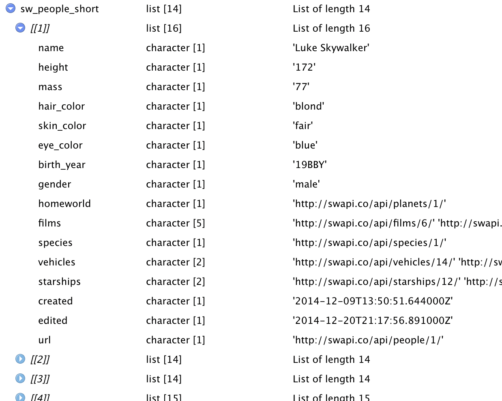

<style type="text/css">
.remark-code {
    font-size: 12px;
}
.font17 {
    font-size: 17px;
}
.font14 {
    font-size: 14px;
}
</style>

<!-- xaringan::inf_mr() -->

# Higher order functions

A higher order functions is a function that takes a function as an argument
or returns a function.

* We call functions that take a function and return data "functionals"
* We call functions that take a function another function a "function operator"

---

# Functionals

The {purrr} package contains many functionals, among those :

* the `map()` family
* `keep()` and `discard()`
* `reduce()` and `accumulate()`

???

In base R we also have functionals, `lapply()`, `sapply()`, `Reduce()`, `Filter()`, `ave()`...

---

# Function operators

The {purrr} package contains many function operators :

* `negate()`
* `safely()`, `quietly()`, `possibly()`, `insistently()`, `slowly()`


The {purrr} package contains both kinds.

---

# The `map()` family

Many functions in R apply a transformation on all elements of a vector or list, we
say they are vectorized :

```{r}
sqrt(c(4, 9, 16)) # same as c(sqrt(4), sqrt(9), sqrt(16))

lengths(list(1, 2:3, 4:6)) # same as c(length(1), length(2:3), length(4:6))
```

Note that `lengths()` is not `length()`, sometimes functions have counterparts
for vectorized use.

---

# The `map()` family

Vectorized functions often have a very efficient implementations but not all
functions are vectorized or have vectorized counterparts.

```{r, error = TRUE}
library(dplyr, warn.conflicts = FALSE)
starwars %>% 
  select(where(is.numeric)) %>% 
  median(na.rm = TRUE)
```

---

# The `map()` family

We've seen already in our course on programming with {dplyr} how to apply
the same transformation
to multiple columns of a data frame by using `mutate()` or `summarize()` with
`across()`

```{r}
summarize(starwars, across(where(is.numeric), median, na.rm = TRUE))
```

This is not general however, a data frame is a special kind of list, with
elements of the same length

```{r, error = TRUE}
median(list(3, 2:4, 1:5))
```

---

# The `map()` family

`map()` offers a general option to apply the same transformation to all elements of a list or vector

It always returns a list

```{r}
library(purrr)
map(list(3, 2:4, 1:5), median)
```

---

# The `map()` family

An important property of tidyverse functions is type stability.

A function is type stable if we can determine the type of its output from the
types of its inputs.

`sapply()` is a base functions that is similar to `map()` but is not type stable.

```{r}
sapply(list(3, 2:4, 1:5), median)
sapply(list(3, 2:4, 1:5), range)
```

???

In both cases here we feed a list to `sapply()`'s first argument, and a function
its second argument, but the output is first a vector then a matrix. 

The base function `lapply()` which is very close to `map()`, is type stable.

---

# The `map()` family

{purrr} offers variants of `map()` that are designed to be type stable, we can
guess the type of their output from their suffix : 

* `map_lgl()` returns a logical vector
* `map_int()` returns an integer vector
* `map_dbl()` returns a double vector
* `map_chr()` return a character vector
* `map_dfr()` return a data frame by row binding the individual intermediate outputs
* `map_dfc()` return a data frame by column binding the individual intermediate outputs

---

# The `map()` family

In our example it's likely that we'd want to return a double vector, easier to
manipulate than a list, so we can improve on our `map()` call

```{r}
map_dbl(list(3, 2:4, 1:5), median)
```

---

# The `map()` family

* character, numeric, or list can be given instead of a function
* Character vectors index by name
* numeric vectors index by position
* lists index by position and name at different levels
* If a component is not present, `.default` is returned

```{r}
x <- list(list(name = "John", surname = "Smith"), list(name = "Sarah", kid_ages = list(8, 10, 12)))
map_chr(x, "name")
map_chr(x, "surname", .default = "Unknown")
map_dbl(x, list("kid_ages", 1), .default = NA)
```

---

# The `map()` family

`map_if()` and `map_at()` are variants of `map()` that apply a transformation
on a subset of the input.
In our example it's likely that we'd want to return a double vector, easier to
manipulate than a list, so we can improve on our `map()` call

```{r}
map_if(list(3, 2:4, 1:5), ~length(.x) <= 3, median)
```

---

# The `map()` family

`map2()` is a variant of `map()` that we can use to apply a transformation
on pairs of elements coming from 2 parallel vectors or lists, given as the
 first 2 arguments.

It also comes with a whole family of type stable variants : `map2_lgl()` etc

```{r}
x <- list(1, 1:2, 1:3)
y <- c(10, 20, 30)
map2(x, y, ~ .x + .y)
```

---

# The `map()` family

`pmap()` is a variant of `map()` that we can use to apply a transformation
on n-tuples of elements coming from n **p**arallel vectors or lists stored
in a list fed as the first argument

It also comes with a whole family of type stable variants : `pmap_lgl()` etc

```{r}
x <- list(1, 1:2, 1:3)
y <- c(10, 20, 30)
z <- 1:3
pmap(list(x, y, z), function(x, y, z) z * (x + y))
```

???

..1 and .x are equivalent

..2 and .y are equivalent

---

# The `map()` family

`imap()` is a variant of `map2()` that takes its main input's names as the
parallel vector

It also comes with a whole family of type stable variants : `imap_lgl()` etc

```{r}
x <- list(a = 1, b = 1:2, c = 1:3)
imap_chr(x, ~paste0(.y, .x, collapse = "-"))
```

---

# The `map()` family

`walk()` is a variant of `map()` that returns its input invisibly

It should be called only for side effects

It also comes with a family : `walk2()`, `iwalk()`, `pwalk()`

```{r, eval = FALSE}
objects_to_write <- list(a = iris, b = cars)
iwalk(objects_to_write, ~ writeRDS(.x, paste0(.y, ".rds")))
```

---

# The `map()` family

Other variants include :

* `map_depth()` to apply recursively to all nested elements
of a given depth.
* `modify()` which works like `map()` but returns an object of the same
type as its input (useful to use on data frames)

---

# The `map()` family

let's practice on a more complex list.

It's hard to explore such an object, sometimes we know its structure, 
sometimes not, here we'll assume that elements share their structure.

```{r}
library(repurrrsive)
sw_people_short <- sw_people[1:14]
names(sw_people_short[[1]])
```

---

# The `map()` family

Using `View()` is useful to explore the structure

```{r, eval = FALSE}
View(sw_people_short)
```



---

# The `map()` family

Extract the names of the characters and set them as the list's names :

```{r}
character_names <- map_chr(sw_people_short, "name") 
sw_people_named <- set_names(sw_people_short, character_names)
```

---

# The `map()` family

How many starships has each character been in?

```{r}
map_dbl(sw_people_named, ~ length(.x[["starships"]]))
```

---

# The `map()` family

What color is each characters hair?

```{r}
map_chr(sw_people_named, "hair_color") 
```

---

# The `map()` family

Is the character male?

```{r}
map_lgl(sw_people_named, ~ .x[["gender"]] == "male") 
```

---

# `keep()` and `discard()`

* `keep()` and `discard()` are opposites
* They subset a list, vector or data frame by keeping or discarding element that
satisfy the predicate function

```{r}
x <- list(23, NA, 14, 7, NA, NA, 24, 98)
discard(x, is.na)
```

---

# `keep()` and `discard()`

We've seen how to count spaceships by character 

```{r}
map_dbl(sw_people_named, ~ length(.x[["starships"]]))
```

How would keep characters that have been in several spaceships?

---

# `keep()` and `discard()`

We've seen how to count how many spaceships characters have been in 

```{r}
map_dbl(sw_people_named, ~ length(.x[["starships"]]))
```

How would keep characters that have been in several spaceships ?

```{r}
sw_starship_people <- keep(sw_people_named, ~ length(.x[["starships"]]) > 1)
names(sw_starship_people)
```

---

# `reduce()` and `accumulate()`

`reduce()` combines elements a vector into a single value by transforming its
first 2 elements into 1, until there is only one remaining.

`accumulate()` keeps the intermediate results and returns a vector or list

`reduce()` is generally more useful but `accumulate()` is easier to understand

```{r}
accumulate(letters[1:4], paste, sep = ".")
reduce(letters[1:4], paste, sep = ".")
```

---

# `reduce()` and `accumulate()`

The function `done()` can be used to stop accumulating early

```{r}
paste4 <- function(out, input, sep = ".") {
  # as soon as we have a more than 4 characters we're done
  if (nchar(out) > 4) {
    return(done(out))
  }
  paste(out, input, sep = sep)
}
accumulate(letters, paste4)
reduce(letters, paste4)
```

---

# Function operators

The {purrr} package contains many function operators, among those :

* `safely()`, `quietly()`, `possibly()`, `insistently()`, `slowly()`

---

# Function operators

`safely()` tranform a function into a function that doesn't fail, but returns
a list containing the results and the possible error

```{r}
safe_log <- safely(log10)
safe_log(100)
safe_log("a")
```

---

# Function operators

We can set a default value

```{r}
safe_log2 <- safely(log10, otherwise = NA)
safe_log2("a")
```

---

# Function operators

`safely()` is most useful with `map()`

```{r}
res <- map(list(100, 1000, "a"), safe_log2)
map_dbl(res, "result")
```

???

`safely()` is useful when you are concerned about an error stopping a long computation,
thanks to `safely()` we can run all iterations and examine the results afterwards.

---

# Function operators

`possibly()` transforms a function so it never fails (it makes every call "possible"), 
and instead returns a default value.

It has similarities with `safely()` but doesn't keep track of errors, which means
less housekeeping

```{r}
possible_log <- possibly(log10, NA)
possible_log(100)
possible_log("a")
```

---

# Function operators

`quietly()` makes a function silent, output, messages and warnings are stored
but not displayed when the function is executed

```{r}
quiet_log <- quietly(log10)
quiet_log(100)
quiet_log(-10)
```

---


# Function operators

`quietly()` makes a function silent, output, messages and warnings are stored
but not displayed when the function is executed

```{r}
quiet_log(-10)
```

---

# Function operators

`slowly()` makes a function wait before its executions

it is useful to limit the frequency of calls to APIs, for web scraping, or to
wait for a resource to be synced.

```{r}
slow_log <- slowly(log10)
system.time(map_dbl(c(10, 100), slow_log))
```

---

# Function operators

`insistently()` makes a function retry if it fails

We can set a delay and many options such as the max amount of tries, the
time between tries, and whether to make this time exponential with a chosen base.

Say we have a function `connect_to_server()`

```{r, eval = FALSE}
insistent_connect <- insistently(connect_to_server, rate_backoff(
  # wait twice more each time
  pause_base = 2,
  # wait maximum 30 sec
  pause_cap = 30,
  # max number of tries
  max_times = 10))
connection <- insistent_connect()
```
