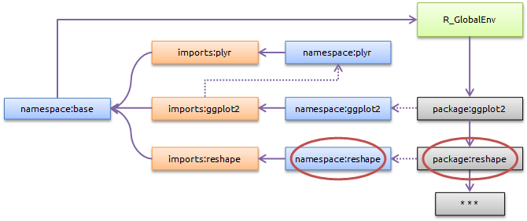
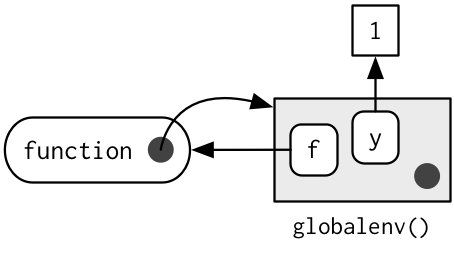
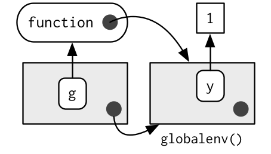

<style type="text/css">
.pull-left {
  margin-top: -25px;
}
.pull-right {
  margin-top: -25px;
}
.remark-code {
    font-size: 12px;
}
.font17 {
    font-size: 17px;
}
.font14 {
    font-size: 14px;
}
.remark-slide-number {
  display: inline;
  font-size: 15px;
}
</style>

# Assignment in R

Assignment means we *bind* a *value* to a *name* in an *environment*.

.pull-left[
```{r}
a <- FALSE
b <- "a"
c <- 2.3
d <- c(1, 2, 3)
```
]

.pull-right[
```{r, echo = FALSE, out.width = "50%", fig.align = "center"}
knitr::include_graphics("bindings.png")
```
]

The assignment operator `<-` performs this *binding* in the current environment, here the global environment (`.GlobalEnv`).

.pull-left[
```{r, eval = FALSE}
0a <- 1
```
```
## Error: unexpected symbol in "0a"
```
]

.pull-right[
```{r, eval = FALSE}
if <- 1
```
```
## Error: unexpected assignment in "if <-"
```
]

There are some rules as to what names are permissible.

---

# Environment basics

- The job of an environment is to associate, or *bind*, a set of names to a set of values.
- A collection of bindings can be thought of as a set, i.e. there is no implied ordering and numeric subsetting is not defined.
- Every name must be unique.
- Environments have **reference semantics**: unlike most R objects, when you modify them, you modify them in place, and do not create a copy.
- Every environment (except `emptyenv()`) has a parent environment.
- Environments can contain themselves.

---

# Components of an environment

Everything is R lives in an *environment*. An environment, like everything else in R is an object (class `environment`), with 2 components:

- A *frame* containing named objects (i.e. *bindings*).
- The environment’s owner, called the *enclosing* (base R) or *parent* (rlang) environment.

```{r, echo = FALSE, out.width = "90%", fig.align = "center"}
knitr::include_graphics("environment-structure.png")
```

---

# Important environments

- The global environment `.GlobalEnv`, more often known as the user's workspace, is the first item on the search path. It can also be accessed by `globalenv()`.
- The object `.BaseNamespaceEnv` is the namespace environment for the base package. The environment of the base package itself is available as `baseenv()`.
- If one follows the chain of *owners* found by repeatedly calling `parent.env()` from any environment, eventually one reaches the empty environment `emptyenv()`, into which nothing may be assigned and which does not have an owner.
- The `environment()` is the current environment.

---

# Exercises

- Create a fresh environment `env` using `new.env()` and perform some assignments (`assign()` or `$<-()`).
- List newly created bindings using `ls()`.
- Retrieve one of the bound values using `get()`.
- What is the enclosing environment of `env`?
- What is the enclosing environment of the global environment?
- Load some package (e.g. `dplyr`). What is the enclosing environment of the global environment now?
- Environments can have names! Create a new environment and name it (using `attr<-()` and setting a `"name"` attribute).
- Check the name using `environmentName()`.

---

# Variable scope

- If a name is not found in an environment, then R will iteratively look through the sequence of enclosing environments.
- This search path, starting with the `.GlobalEnv`, and ending with `baseenv()`, is shown when calling `search()`.
- As we have seen before, attaching packages (e.g. by calling `library()`) alters the search path.

---

# Package environments I

```{r, echo = FALSE, out.width = "85%", fig.align = "center"}
knitr::include_graphics("map-of-the-world.png")
```

The solid purple line represents the enclosing environment relationship.

---

# Package environments II

Associated with each package, we have 3 environments.

```{r, echo = FALSE, out.width = "85%", fig.align = "center"}

```

- **Package environment**: Objects (mostly functions) that are *exported* from a package. In an OOP analogy, this corresponds to *public* classes/methods.
- **Namespace environment**: All (including exported) objects associated with a package. Nothing is duplicated, the same values are simply bound in different environments.
- **Imports environment**: Objects from other packages that are explicitly stated requirements for the package in question.

---

# Imports/depends

Example: ggplot v0.8.9; DESCRIPTION:

```
Package: ggplot2
Type: Package
Title: An implementation of the Grammar of Graphics
Version: 0.8.9
Author: Hadley Wickham <h.wickham@gmail.com>
Maintainer: Hadley Wickham <h.wickham@gmail.com>
Description: ...
Depends: reshape (>= 0.8.0), grid, proto
Imports: plyr (>= 1.0), splines, MASS, RColorBrewer, digest, colorspace
Suggests: quantreg, Hmisc, mapproj, maps, hexbin, gpclib, maptools
...
```

This (slightly old) {ggplot2} version had {plyr} as *imports* dependency and {reshape} as *depends* dependency.

---

# Imports I

The {plyr} package is specified as an *imports* dependency.

```{r, echo = FALSE, out.width = "85%", fig.align = "center"}
knitr::include_graphics("imports-depends-plyr.png")
```

As such, when loading {ggplot2} it is ensured that the {plyr} namespace environment is available and its objects are accessible using `::()` and `:::()`.

---

# Imports II

Using {roxygen2} `@importFrom` (or `@import`) tags

```
#' @importFrom utils head
```

will create `importFrom()` directives in NAMESPACE

```
importFrom(utils,head)
```

which in turn will create bindings in the package imports environment

```{r eval = FALSE}
ls(envir = parent.env(asNamespace("myPkg")))
```

```
## [1] "head"
```

Such objects are now directly accessible (no need for `::()`).

---

# Depends I

A depends dependency is not only loaded, but also attached (as if `library()` or `require()` were called).

```{r, echo = FALSE, out.width = "85%", fig.align = "center"}

```

The {reshape} package is inserted *before* {ggplot2} and its package environment becomes the enclosing environment of the {ggplot2} package environment.

---

# Depends II

In general, *depends* dependencies are discouraged.

- Name conflicts in the set of dependencies can lead to masking.
- Subtle bugs may be introduced, as name resolution depends on the state of the search path.

Assume, {reshape2} is attached after {ggplot2}, i.e. comes before in the search path and {ggplot2} calls the function `cast()`, which is exported from both {reshape} and {reshape2}. What will happen?

---

# Function environments I

Several environments are associated with a function:

- The *enclosing* environment is the environment where the function was created.
- Binding a function to a name with <- defines a *binding* environment.
- Calling a function creates an *execution* environment that stores variables created during execution.
- Every execution environment is associated with a *calling* environment, i.e. the environment from which the function was called.

---

# Binding environments

When a function is created, the environment where this happens is set as the *enclosing* environment and is used for variable scoping.

.pull-left[
```{r}
y <- 1
f <- function(x) x + y
environment(f)
```
]

.pull-right[
```{r, echo = FALSE, out.width = "50%", fig.align = "center"}

```
]

The 0, 1, or many *binding* environments may differ from the *enclosing* environment.

.pull-left[
```{r}
e <- new.env()
e$g <- function() 1
```
]

.pull-right[
```{r, echo = FALSE, out.width = "50%", fig.align = "center"}

```
]

---

# Exercise

```{r, eval = FALSE}
age <- 32
my_fun <- function() {

  age <- 22

  fun_1 <- function() print(age + 1)
  fun_2 <- function() print(age + 1)

  fun_3 <- function() {
    age <- 11
    print(age + 1)
  }

  environment(fun_2) <- .GlobalEnv

  fun_1()
  fun_2()
  fun_3()
}
my_fun()
```

What will each function print?

---

# Function environments II

- The *enclosing* environment pointers were indicated in previous diagrams by dotted purple lines.
-  This property makes it possible to, for example, to create a binding in an *imports* environment of a package, while not messing up variable (i.e. function) lookup for the imported function.

```{r}
sd
x <- 1:10
sd(x)
var <- function(x, na.rm = TRUE) 100
sd(x)
```
