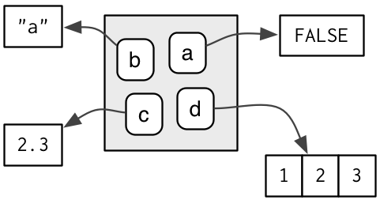
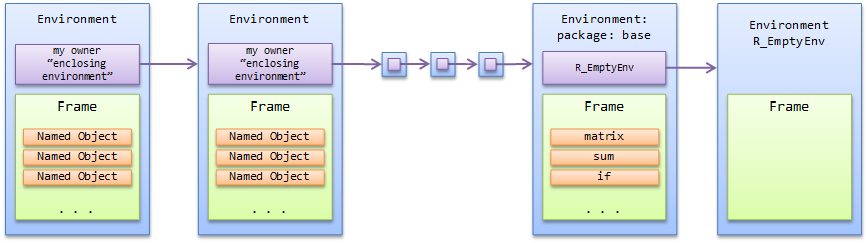
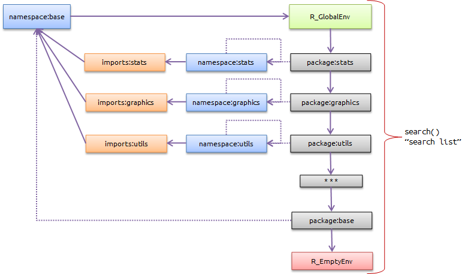

<style type="text/css">
.remark-code {
    font-size: 12px;
}
.font17 {
    font-size: 17px;
}
.font14 {
    font-size: 14px;
}
</style>

# Assignment in R

Assignment means we *bind* a *value* to a *name* in an *environment*.

.pull-left[
```{r}
a <- FALSE
b <- "a"
c <- 2.3
d <- c(1, 2, 3)
```
]

.pull-right[
```{r, echo = FALSE, out.width = "50%", fig.align = "center"}

```
]

The assignment operator `<-` performs this *binding* in the current environment, here the global environment (`.GlobalEnv`).

.pull-left[
```{r, eval = FALSE}
0a <- 1
```
```
## Error: unexpected symbol in "0a"
```
]

.pull-right[
```{r, eval = FALSE}
if <- 1
```
```
## Error: unexpected assignment in "if <-"
```
]

There are some rules as to what names are permissible.

---

# Environment basics

- The job of an environment is to associate, or *bind*, a set of names to a set of values.
- A collection of bindings can be thought of as a set, i.e. there is no implied ordering and numeric subsetting is not defined.
- Every name must be unique.
- Environments have **reference semantics**: unlike most R objects, when you modify them, you modify them in place, and do not create a copy.
- Every environment (except `emptyenv()`) has a parent environment.
- Environments can contain themselves.

---

# Components of an environment

Everything is R lives in an *environment*. An environment, like everything else in R is an object (class `environment`), with 2 components:

- A *frame* containing named objects (i.e. *bindings*).
- The environment’s owner, called the *enclosing* (base R) or *parent* (rlang) environment.

```{r, echo = FALSE, out.width = "90%", fig.align = "center"}

```

---

# Important environments

- The global environment `.GlobalEnv`, more often known as the user's workspace, is the first item on the search path. It can also be accessed by `globalenv()`.
- The object `.BaseNamespaceEnv` is the namespace environment for the base package. The environment of the base package itself is available as `baseenv()`.
- If one follows the chain of *owners* found by repeatedly calling `parent.env()` from any environment, eventually one reaches the empty environment `emptyenv()`, into which nothing may be assigned and which does not have an owner.
- The `environment()` is the current environment.

---

# Exercises

- Create a fresh environment `env` using `new.env()` and perform some assignments (`assign()` or `$<-()`).
- List newly created bindings using `ls()`.
- Retrieve one of the bound values using `get()`.
- What is the enclosing environment of `env`?
- What is the enclosing environment of the global environment?
- Load some package (e.g. `dplyr`). What is the enclosing environment of the global environment now?
- Environments can have names! Create a new environment and name it (using `attr<-()` and setting a `"name"` attribute).
- Check the name using `environmentName()`.

---

# Variable scope

- If a name is not found in an environment, then R will iteratively look through the sequence of enclosing environments.
- This search path, starting with the `.GlobalEnv`, and ending with `baseenv()`, is shown when calling `search()`.
- As we have seen before, attaching packages (e.g. by calling `library()`) alters the search path.

---

# Package environments I

```{r, echo = FALSE, out.width = "75%", fig.align = "center"}

```

The solid purple line represents the enclosing environment relationship.
