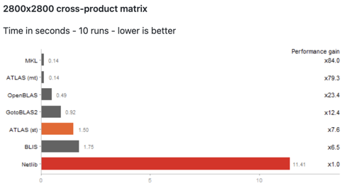
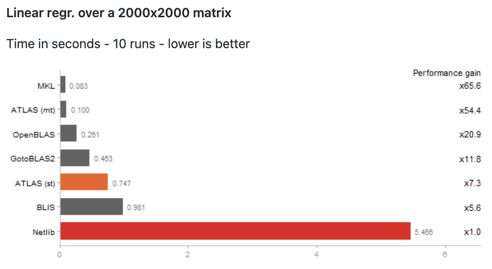

# What's in the box?

1. Caching / Memoization

1. BLAS/LAPACK

1. Data handling - practical considerations

1. Parallelization

1. Profiling

1. Benchmarking

---

class: center, inverse, middle

# Section - Caching / Memoization

---

## Caching / Memoization

Reuse previously computed output in subsequent calls.

R packages

- {memoise} - https://github.com/r-lib/memoise
- {R.cache} - https://github.com/HenrikBengtsson/R.cache

Useful when making repeated calls to a function with **identical parameters** and a **deterministic** outcome.

---

## Caching / Memoization

Good to know:

- Objects are cached in memory by default and eventually pruned if they exceed a certain size

- Only cache outcomes that are **deterministic**

- {memoise} allows for many cache types (S3, disk, memory)

---

## Caching / Memoization (Example)

Credit: https://github.com/r-lib/memoise

.small[
```{r }
library(memoise)
mean_fun <- function(x) {
  Sys.sleep(1) # represents some long computation part
  mean(x)}
mean_fun <- memoise(mean_fun)
```

```{r }
system.time(mean_fun(1:10))
system.time(mean_fun(1:10))

is.memoised(mean_fun)
```
]

---

class: center, inverse, middle

# Section - BLAS + LAPACK

---

### BLAS + LAPACK

- BLAS: Basic Linear Algebra Subprograms
- LAPACK: Linear Algebra Package

Main libraries for *linear algebra* computations.

CRAN ships it's installers with standalone BLAS and LAPACK libraries which are well tested but often lack in terms of performance against other implementations.

.info[
ℹ️ To check your current BLAS/LAPACK libraries in R, execute `sessionInfo()`.
]

---

Other BLAS and LAPACK libraries:

- ATLAS (Automatically Tuned Linear Algebra Software) http://math-atlas.sourceforge.net/
- OpenBLAS - https://www.openblas.net/
- IntelMKL (only for Intel CPUs)

To link against such external libraries, R needs to be **installed from source**.
This is usually recommended for centrally managed R installations on servers or HPC clusters.

More information: https://cran.r-project.org/doc/manuals/r-release/R-admin.html#Linear-algebra

---

class: center

**Source: https://github.com/andre-wojtowicz/blas-benchmarks**





---

class: center, inverse, middle

# Section - Data handling

---

## Data handling - practical considerations

.info[
☝️ Know where your data is written to
]

Writing/compressing/serializing large datasets (MB, GB) is limited by the **write speed of the underlying disk**.
Often, disks with lots of space (usually HDDs) do have a slow read/write performance.
This causes read/write/move processes to appear slow as the disk speed is the bottleneck.

The same goes for **file shares/file mounts** of pretty much **any protocol** (samba, sshfs, nfs, etc.).
The mileage varies among protocols but reading/writing to file shares will usually never be percieved as "fast".

---

## Data handling - practical considerations

.info[
💡️ To speed things up, perform read/write operations on the local file system, preferably on SSD drives.
]

BUT: Avoid **big reoccurring write tasks on SSDs** if possible as this will (quickly) reduce a SSDs lifetime.

- If possible, try to use **databases**.
- If possible, keep things **in memory** and only write to disk when it's really needed.

---

## Data handling - practical considerations

Alternatives to R's native `saveRDS()` and `readRDS()`

- {fst} package (tabular data only): https://github.com/fstpackage/fst
- {qs} package: https://github.com/traversc/qs (Example 👇️)

.center[

]

---

## Data handling - Exercise `flights` dataset

1. Load the `flights` dataset from the {nycflights13} package
1. Serialize it via `saveRDS()` and track the time
1. Serialize it via {fst} and track the time
1. Serialize it via {qs} and track the time
1. Serialize it via {fst} with openMP and track the time
1. Serialize it via {qs} and use the "fast" mode
1. Serialize it via {qs} and use the "fast" mode and all available cores of your machine
1. Read rows 100:200 of the `"dep_time"` column using {fst}
1. Read rows 100:200 of the `"dep_time"` column using {qs}
1. Read rows 100:200 of the `"dep_time"` column using {saveRDS}
1. (optional) execute all of the above in a dedicated benchmarking tool

---

## Data handling - practical considerations

[Apache Arrow](https://github.com/apache/arrow/)

- High-performance reading and writing of data files with multiple file formats and compression codecs, including built-in support for cloud storage
- Analyzing and manipulating bigger-than-memory data with {dplyr} verbs
- Supports various formats
  - feather
  - parquet
  - json
  - csv

---

## Data handling - Arrow exercise

Helpful instructions at: https://arrow.apache.org/docs/r/articles/dataset.html

1. Download the NYC Taxi data **for the year 2010**.
  (don't copy all data, one year takes already few minutes and is about 5GB in size)

2. List and sum the file size of the downloaded data (careful, tricky)

3. Print the overall passenger count for March

---

class: center, inverse, middle

# Section - Parallelization

---

## Parallelization

### Motivation

- Use the resources your machine provides
- Execute independent analysis parts asynchronous
- Scale up your analysis if needed

### Goal

👉️ Get an overview of the available parallelization options in R

👉️ Understand how to go parallel in practice

✋️ Avoid common pitfalls

---

### Available libraries

**R base**

- {parallel} package

**Community**

- {future} framework
  - {future.callr}
  - {doFuture}
  - {future.apply}
  - {future.batchtools}
  - {furrr}

- {foreach} package

---

### Iteration concepts

.pull-left[

Two main iteration concepts exist in R:

- for-loops
- The apply-family

]

.pull-right[

Two main parallel execution concepts exist in R:

- socket-based (PSOCK) (default)
- Forking (UNIX only)

]

💡️ Parallelization packages combine the **iteration concepts** (left) with the **parallel concepts** (right) to allow for parallelized execution with minimal code adaptions compared to sequential execution.

---

## Other parallelization frameworks

Mainly for High-Performance-Computing (HPC) jobs.
Usually requires third-party tools.

- [MPI](https://en.wikipedia.org/wiki/Message_Passing_Interface) (R package: [{Rmpi}](https://cran.r-project.org/web/packages/Rmpi/index.html))
- [openMP](https://www.openmp.org/)

Interfaces to *HPC schedulers* (SLURM, LSF, TORQUE, SGE):

- ZeroMQ (R package: [{clustermq}](https://mschubert.github.io/clustermq/))

- Batchtools (R package: [{batchtools}](https://mllg.github.io/batchtools/))

---

### PSOCK vs. forking

.fl.w-50.pr2[
**PSOCK**

Creates a socket cluster of R workers which use `Rscript` to execute code
]

.fl.w-40.pa0[
**Forking**

Creates copies of the current R process.
Both parent and child process share the same memory.
]

---

### PSOCK cluster vs. forking

.fl.w-50.pr2[
**PSOCK**

.small[

➕️ Available on all platforms

➖️ Requires to create/copy required objects into the worker environment as the workers are not full copies of the master process

➖️ Higher initialization time than forking, though since R v4 worker creation happens in parallel
]
]

.fl.w-50.pa0[
**Forking**

.small[
➕️ Relatively cheap

➕️ Almost no setup costs, immediate start


➖️ Should/cannot be used in GUI applications (e.g. RStudio) as the forked processes will share a copy of the GUI process.
  This may lead to crashes or deadlocks

➖️ Should not be used in multithreaded R processes (i.e. nested/stacked parallelization)

➖️ Not available on Windows
]
]

---

### Examples

**{foreach}** - https://github.com/RevolutionAnalytics/foreach

```{r eval=FALSE}
dat_list <- split(iris, iris$Species)
mod_list <- vector("list", length(dat_list))

for (i in seq_along(dat_list)) {
  mod_list[[i]] <- lm(Sepal.Length ~ Sepal.Width +
    Petal.Length + Petal.Width, data = dat_list[[i]])
}
```

---

### Examples

**{foreach}** - https://github.com/RevolutionAnalytics/foreach

.info[
Sequential
]

```{r eval=FALSE}
library(foreach)
mod_list2 <- foreach(dat = dat_list) %do% {
  lm(Sepal.Length ~ Sepal.Width + Petal.Length +
    Petal.Width, data = dat)
}
```

---

### Examples

**{foreach}** - https://github.com/RevolutionAnalytics/foreach

.info[
Parallel
]

Note the `%dopar%` adaptor.

```{r eval=FALSE}
library(foreach)
mod_list2 <- foreach(dat = dat_list) %dopar% {
  lm(Sepal.Length ~ Sepal.Width + Petal.Length +
    Petal.Width, data = dat)
}
```

---

### Examples

**{foreach}** - Adaptors

- `%dopar%`: Native parallel adaptor from {foreach} using socket parallelization
- `%doMC%`: Custom "multicore" adaptor from {doMC}
- `%doMPI%`: Custom MPI-based parallel adaptor from {doMPI}
- `%doRNG%`: Custom parallel adaptor from {doRNG} for reproducible parallel loops
- `%doSNOW%`: Custom parallel adaptor from {doSNOW}
- `%dopar%`: via {doFuture} - a "better" version of all of the above

---

### Benefits of {doFuture}


- Takes care of exports and packages automatically

- Allows to select the backend via the cannonical {future} syntax (`plan(<backend>)`)

- Only one package to deal with for users

- Actively maintained

---

### apply-parallelization

**built-in**

- `parallel::mclapply()`
- `parallel::mcmapply()`
- `parallel::parApply()`
- `parallel::parLapply()`
- `parallel::parSapply()`
- `parallel::parRapply()`

**{future}**

- `{furrr}` - parallelized {purrr} using {future} internally
- Using {future} and basic `apply*` functions
- Using {future} and {future.apply}: `future_lapply()`

---

### {future}-based apply-parallelization

**{furrr}** - https://github.com/DavisVaughan/furrr

- Allows to use the {future} backend with {purrr} syntax
- {purrr} functions are prefixed with `future_`
- Go parallel with `plan(<parallel plan>)`

Examples:

- `map()` - `future_map()`
- `walk()` - `future_walk()`
- `imap2()` - `future_imap2()`
- etc.

---

### {future}-based apply-parallelization

**{future.apply}** - https://github.com/HenrikBengtsson/future.apply

- Similar as {furrr} but for base R `apply*` functions.
- Go parallel with `plan(<parallel plan>)`.

Examples:

- `lapply()` - `future_lapply()`
- `mapply()` - `future_mapply()`
- `vapply()` - `future_vapply()`
- etc.

---

### future - Exercises

.info[
  Duration: 15 mins
]

Write some code that iterates over multiple objects (e.g. in a list) and runs a few seconds.

Choose your parallel workhorse (foreach, future, apply, furrr, etc.).

Try different parallel backends (socket parallelization, forking (if possible), callr, etc.)

**What problems do you face?**
**Is something still unclear?**

---

### {future} examples

From https://future.futureverse.org/articles/future-1-overview.html#demos

Run the following code and exchange `sequential` in the `plan()` function

```{r eval=FALSE}
library("future")
plan(sequential)
demo("mandelbrot", package = "future", ask = FALSE)
```

Curious what is happening under the hood? 👉️ see next slide

---

### {future} examples

Source: https://github.com/HenrikBengtsson/future/blob/develop/demo/mandelbrot.R

The following `lapply()` call is executed in parallel when a parallel `plan()` (e.g. `plan(multisession)`) is applied.

```{r eval=FALSE}
lapply(seq_along(Cs), FUN=function(ii) {
  future({
    message(sprintf("Calculating tile #%d of %d ...", ii, n))
    fit <- mandelbrot(C)
  })
}
```

---

### {future} examples

Available {future} backends:

- `sequential`
- `multisession` (= socket parallelization)
- `multicore` (= forking parallelization)
- `callr` (via {future.callr}) (possibly >> multisession)
- `batchtools`

---

## Parallelization - Putting it all together

**Do you like for-loops?**

 ➡️ {foreach} + {doFuture} + `%doRNG%` adaptor for reproducibility (optional)

**Do you like the apply family?**

Do you like {purrr}? ➡️ {furrr} or {future}

Do you favor the classical apply functions? ➡️ `future()` + `lapply()` & friends or `future_*apply()` via {future.apply}

---


class: center, inverse, middle

# Section - Profiling

---

### Profiling

**Profiling** aims to unravel code parts with respect to

  - execution time
  - memory consumption

This can help to optimize code and reduce runtime and resource usage.

---

### Profiling - R packages

- {profvis} - https://rstudio.github.io/profvis
- {proffer} - https://r-prof.github.io/proffer
- {profmem} - https://github.com/HenrikBengtsson/profmem

and more, see https://cran.r-project.org/web/views/HighPerformanceComputing.html.

---

### Profiling - Example

Taken from https://github.com/r-prof/proffer

Note: Your timing result will depend on your respective hardware.

```{r , eval=FALSE}
system.time({
  n <- 1e5
  x <- data.frame(x = rnorm(n), y = rnorm(n))
  for (i in seq_len(n)) {
    x[i, ] <- x[i, ] + 1
  }
  x
})

##    user  system elapsed
##  52.205   9.026  61.745
```

---

### Profiling - Example (slow)

```{r, eval=FALSE}
library(proffer)
px <- pprof({
  n <- 1e5
  x <- data.frame(x = rnorm(n), y = rnorm(n))
  for (i in seq_len(n)) {
    x[i, ] <- x[i, ] + 1
  }
  x
})
```

.info[
ℹ️ Execute in an editor, e.g. RStudio or VSCode
]

---

### Profiling - Example (fast)

Avoid data.frame row assignments - use vectors directly!
```{r , eval=FALSE}
system.time({
  n <- 1e5
  x <- rnorm(n)
  y <- rnorm(n)
  for (i in seq_len(n)) {
    x[i] <- x[i] + 1
    y[i] <- y[i] + 1
  }
  x <- data.frame(x = x, y = y)
})

##    user  system elapsed
##   0.016   0.001   0.016
```

---

## Resources

**Parallelization**

- [Video: Barret Schloerke || Maximize computing resources using future_promise()](https://www.youtube.com/watch?v=3gtk8uRrrL4)
- [{future} documentation and vignettes](https://future.futureverse.org/)

**R Configuration**

- [CRAN: R admin manual](https://cran.r-project.org/doc/manuals/r-release/R-admin.html)

**General best practices**

- [Book: "Efficient R" - Colin Gillespie & Robin Lovelace](https://csgillespie.github.io/efficientR)

**BLAS/LAPACK**

- [Benchmark of BLAS libraries in R](https://github.com/andre-wojtowicz/blas-benchmarks)

```{r xaringan-extra, echo=FALSE}
xaringanExtra::use_tile_view()
xaringanExtra::use_fit_screen()
xaringanExtra::use_extra_styles(
  hover_code_line = TRUE,
  mute_unhighlighted_code = TRUE
)
xaringanExtra::use_progress_bar(color = "#0051BA", location = "top", height = "0.1em")
# css framework
xaringanExtra::use_tachyons()
```

```{r xaringanExtra-clipboard, echo=FALSE}
xaringan_themer_css <- "./cynkra-xaringan.css"
xaringanthemer::style_xaringan(
  extra_css = list(
    # "li" = list("padding" = "8px 0px 0px"),
  ), outfile = xaringan_themer_css
)
htmltools::tagList(
  xaringanExtra::use_clipboard(
    button_text = "<i class=\"fa fa-clipboard\"></i>",
    success_text = "<i class=\"fa fa-check\" style=\"color: #90BE6D\"></i>",
    error_text = "<i class=\"fa fa-times-circle\" style=\"color: #F94144\"></i>"
  ),
  rmarkdown::html_dependency_font_awesome()
)
```


```{css }
.remark-slide-content h1 {
  /*color: #5DA5DA;*/
  color: inherit;
  /*r blue*/
  /*color: rgb(31, 101, 183);*/

  font-weight: 600;
  font-size: 45px;
  /*text-transform: uppercase;*/
}

.remark-slide-content h2 {
  color: inherit;

  /*color: rgb(31, 101, 183);*/
  font-weight: 600;
  font-size: 30px;
}

.remark-slide-content h3 {
  color: inherit;

  /*color: #4D4D4D;*/
  font-weight: 600;
  font-size: 30px;
}

.title-slide h3 {
  color: #333 !important;
}

.remark-slide-content {
  /* default: padding: 1em 4em 1em 4em; */
  padding: 1em 2em 1em 2em;
}

.small {
  font-size: 75%;
}

.small .remark-code {
  font-size: 85%;
}

.info {
  background-color: rgb(31 101 183);
  font-weight: 600;
  border-radius: 6px;
  padding-left: 6px;
  color: white;
  border-left: solid 12px #faa43a;
}

.code,
code {
  font-size: 0.9em;
}

.remark-slide-number {
  color: inherit;
  /* font-size: 10pt !important; */
  /* margin-bottom: -11.6px !important; */
  /* margin-right: 10px !important; */
  /* color: #333 !important; */
  opacity: 0.9 !important;
}

a {
  color: #498e33 !important;
}

```
