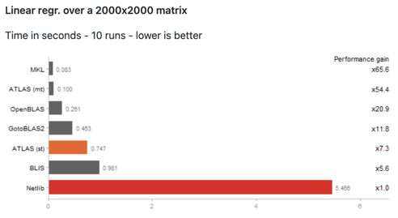

```{r xaringan-extra, echo=FALSE}
xaringanExtra::use_tile_view()
xaringanExtra::use_fit_screen()
xaringanExtra::use_scribble()
xaringanExtra::use_webcam()
xaringanExtra::use_extra_styles(
  hover_code_line = TRUE,
  mute_unhighlighted_code = TRUE
)
xaringanExtra::use_progress_bar(color = "#0051BA", location = "top", height = "0.1em")
# css framework
xaringanExtra::use_tachyons()
```

```{r xaringanExtra-clipboard, echo=FALSE}
xaringan_themer_css <- "./cynkra-xaringan.css"
xaringanthemer::style_xaringan(
  extra_css = list(
    # "li" = list("padding" = "8px 0px 0px"),
  ), outfile = xaringan_themer_css
)
htmltools::tagList(
  xaringanExtra::use_clipboard(
    button_text = "<i class=\"fa fa-clipboard\"></i>",
    success_text = "<i class=\"fa fa-check\" style=\"color: #90BE6D\"></i>",
    error_text = "<i class=\"fa fa-times-circle\" style=\"color: #F94144\"></i>"
  ),
  rmarkdown::html_dependency_font_awesome()
)
```


```{css, echo = FALSE }
.remark-slide-content h1 {
  /*color: #5DA5DA;*/
  color: inherit;
  /*r blue*/
  /*color: rgb(31, 101, 183);*/

  font-weight: 600;
  font-size: 45px;
  /*text-transform: uppercase;*/
}

.remark-slide-content h2 {
  color: inherit;

  /*color: rgb(31, 101, 183);*/
  font-weight: 600;
  font-size: 30px;
}

.remark-slide-content h3 {
  color: inherit;

  /*color: #4D4D4D;*/
  font-weight: 600;
  font-size: 30px;
}

.title-slide h3 {
  color: #333 !important;
}

.remark-slide-content {
  /* default: padding: 1em 4em 1em 4em; */
  padding: 1em 2em 1em 2em;
}

.small {
  font-size: 75%;
}

.small .remark-code {
  font-size: 85%;
}

.code08 .remark-code {
  font-size: 0.8em;
}

.info {
  background-color: rgb(31 101 183);
  font-weight: 600;
  border-radius: 6px;
  padding-left: 6px;
  color: white;
  border-left: solid 12px #faa43a;
}

.code,
code {
  font-size: 0.9em;
}

.code-small,
remark-code {
  font-size: 0.8em;
}

.remark-slide-number {
  color: inherit !important;
  opacity: 0.9 !important;
}

a {
  color: #498e33 !important;
}

```

## Who I am

.fl.w-50.pr1[

.center[

]

- M.Sc. Geoinformatics
- Previously researcher at University of **Jena** and LMU **Munich**
- **Head of Infrastructure** at cynkra
- PhD Candidate (Environmental modelling)

]

.fl.w-50.pr1[
- Unix & R enthusiast

- [Gitea](https://gitea.io/en-us/) (https://gitea.io) contributor

- Member of mlr-org core team; Machine learning in R 
  - [{mlr3}](https://github.com/mlr-org/mlr3)
  - [{mlr}](https://github.com/mlr-org/mlr)

]

---

# What's in the box?

1. Caching / Memoization

1. BLAS/LAPACK

1. Parallelization
  - for-loops
  - apply-family
  - Reproducibility

1. Profiling

1. Benchmarking

1. Efficient data handling

---

# Schedule

- (13:30) 10 min Intro
- (13:40) Caching & Memoization (10 mins, pres only)
- (13:50) BLAS/LAPACK (10 mins, pres only)
- (14:00) Parallelization
- (14:45) BREAK (20 mins)
- (15:05) Parallelization
- (15:45) Profiling
- (16:00) Benchmarking
- (16:20) Efficient data handling

---

class: center, inverse, middle

# Section - Caching / Memoization

---

## Caching / Memoization

Reuse previously computed output in subsequent calls.

R packages

- {memoise} - https://github.com/r-lib/memoise
- {R.cache} - https://github.com/HenrikBengtsson/R.cache

Useful when making repeated calls to a function with **identical parameters** and a **deterministic** outcome.

---

## Caching / Memoization

Good to know:

- Objects are cached in memory by default and eventually pruned if they exceed a certain size

- Only cache outcomes that are **deterministic**

- {memoise} allows for many cache types (S3, disk, memory)

---

## Caching / Memoization (Example)

Credit: https://github.com/r-lib/memoise

.small[
```{r }
library(memoise)
mean_fun <- function(x) {
  Sys.sleep(1) # represents some long computation part
  mean(x)}
mean_fun <- memoise(mean_fun)
```

```{r }
system.time(mean_fun(1:10))
system.time(mean_fun(1:10))

is.memoised(mean_fun)
```
]

---

class: center, inverse, middle

# Section - BLAS + LAPACK

---

### BLAS + LAPACK

- BLAS: Basic Linear Algebra Subprograms
- LAPACK: Linear Algebra Package

Main libraries for *linear algebra* computations.

CRAN ships it's installers with standalone BLAS and LAPACK libraries which are well tested but often lack in terms of performance against other implementations.

.info[
ℹ️ To check your current BLAS/LAPACK libraries in R, execute `sessionInfo()`.
]

---

Other BLAS and LAPACK libraries:

- ATLAS (Automatically Tuned Linear Algebra Software) http://math-atlas.sourceforge.net/
- OpenBLAS - https://www.openblas.net/
- IntelMKL (only for Intel CPUs)

To link against such external libraries, R needs to be **installed from source**.
This is usually recommended for centrally managed R installations on servers or HPC clusters.

More information: https://cran.r-project.org/doc/manuals/r-release/R-admin.html#Linear-algebra

---

### Unoffical R interpreters

[Microsoft R Application Network (MRAN)](https://mran.microsoft.com/)

- Available on all platforms
- With optimized BLAS/LAPACK by default

[fastR](https://github.com/oracle/fastr)

- A high-performance implementation of the R programming language, built on GraalVM.
- Speed up around 36x
- Not all R packages are supported
- Needs "GraalVM" (https://www.graalvm.org)


---

class: center

**Source: https://github.com/andre-wojtowicz/blas-benchmarks**




---

class: center, inverse, middle

# Section - Parallelization

---

## Parallelization

### Motivation

- Use the resources your machine provides
- Execute independent analysis parts asynchronous
- Scale up your analysis if needed

### Goal

👉️ Get an overview of the available parallelization options/framework in R

👉️ Practically understand how to go parallel

ℹ️️ Understand the differences of the various concepts

---

### Available libraries

**R base**

- {parallel} package

**Community**

- {future} framework
  - {future.callr}
  - {doFuture}
  - {future.apply}
  - {future.batchtools}
  - {furrr}
- {foreach} package
- {promises} (focus on shiny)

---

### Iteration concepts

.pull-left[
Two main *iteration* concepts exist in R:

- for-loops
- The apply-family
]

.pull-right[
Two main *parallel execution* concepts exist in R:

- socket-based (PSOCK) (default)
- Forking (UNIX only)
]

💡️ Parallelization packages in R combine the **iteration concepts** (left) with the **parallel execution concepts** (right) to allow for parallelized execution with minimal code adaptions compared to sequential execution.

---

## Other parallelization frameworks

Making use of non-R parallelization libraries often requires third-party tools or explicit linking during installation.

- [openMP](https://www.openmp.org/) (implicit code parallelization, configured during compile time of R packages, e.g. in {data.table}, {fst}, etc.)

Messaging Interfaces to *HPC schedulers* (SLURM, LSF, TORQUE, SGE):

- [MPI](https://en.wikipedia.org/wiki/Message_Passing_Interface) (R package: [{Rmpi}](https://cran.r-project.org/web/packages/Rmpi/index.html))

- [ZeroMQ](https://github.com/zeromq/libzmq) (R package: [{clustermq}](https://mschubert.github.io/clustermq/))

Other HPC related frameworks:

- R package [{batchtools}](https://mllg.github.io/batchtools/))

---

### PSOCK vs. forking

.fl.w-50.pr1[
**PSOCK**

The "p" means "created by the parallel package".

Creates a socket cluster of R workers which use `Rscript` to execute code.
]

.fl.w-50.pl1[
**Forking**

Creates copies of the current R process.

At the point of forking child processes share exactly the same state including the workspace, global options, loaded packages etc.
]

---

### PSOCK cluster vs. forking

.fl.w-50.pr2[
**PSOCK**

.small[

➕️ Available on all platforms

➖️ Requires to create/copy required objects into the worker environment as the workers are not full copies of the master process

➖️ Higher initialization time than forking, though since R v4 worker creation happens in parallel
]
]

.fl.w-50.pa0[
**Forking**

.small[
➕️ Relatively cheap

➕️ Almost no setup costs, immediate start


➖️ Should/cannot be used in GUI applications (e.g. RStudio) as the forked processes will share a copy of the GUI process.
  This may lead to crashes or deadlocks

➖️ Caution should be taken when combining forking with multithreaded R processes (e.g. via openMP), i.e. nested/stacked parallelization

➖️ Not available on Windows
]
]

---

### Examples

**{foreach}** - https://github.com/RevolutionAnalytics/foreach

```{r eval=FALSE}
  vec = c(2, 2, 2)
  for (i in vec) {
    Sys.sleep(i)
  }
```

---

### Examples

**{foreach}** - https://github.com/RevolutionAnalytics/foreach

.info[
Sequential
]

```{r eval=FALSE}
library(foreach)
vec = c(2, 2, 2)
foreach (i = vec) %do% {
  Sys.sleep(i)
}
```

---

### Examples

**{foreach}** - https://github.com/RevolutionAnalytics/foreach

.info[
Parallel
]

Note the `%dopar%` adaptor and cluster initialization

```{r eval=FALSE}
library(foreach)
library(doParallel)
registerDoParallel(3)

foreach (i = vec) %dopar% {
  Sys.sleep(i)
}
```

---

### Examples

**{foreach}** - Adaptors

- `%dopar%`: Native parallel adaptor from {foreach} using socket parallelization
- `%doMC%`: Custom "multicore" adaptor from {doMC}
- `%doMPI%`: Custom MPI-based parallel adaptor from {doMPI}
- `%doRNG%`: Custom parallel adaptor from {doRNG} for reproducible parallel loops
- `%doSNOW%`: Custom parallel adaptor from {doSNOW}
- `%dopar%`: via {doFuture} - a "better" version of all of the above

---

### Benefits of the {doFuture} parallel adaptor

- Takes care of object and package exports automatically

- Allows to select the backend via the cannonical {future} syntax (`plan(<backend>)`)

- Only one package to deal with for users

- Actively maintained

---

### Parallelization - Exercises

.info[
  Duration: 10 mins
]

The code on the next slide finishes in a little bit more than two seconds in parallel (when using 3 cores) and in about six seconds sequentially.

Rewrite the code using different parallel variations in R:

- {foreach} and {doFuture} using the `"multisession"` backend
- {foreach} and {doFuture} using the `"future.callr"` backend

(hint: do research how to init parallel backends via {future})

---

### Parallelization - Exercises

```{r eval = FALSE}
system.time({
  vec = c(2, 2, 2)
  for (i in vec) {
    Sys.sleep(i)
  }
})
```

👉️ Inspect the time differences between the different parallel options.

.small[
(Solutions can be found in `exercises/parallelization-solutions.R`)
]

---

### apply-parallelization - Available options

**{parallel}** (built-in)

- `parallel::mclapply()`
- `parallel::mcmapply()`
- `parallel::parApply()`
- `parallel::parLapply()`
- `parallel::parSapply()`
- `parallel::parRapply()`

**{future}** (community)

- `{furrr}` - parallelized {purrr} using {future} internally
- Using {future} with `future()` and basic `apply*` functions
- Using {future} and {future.apply}: e.g. `future_lapply()`

---

### {future}-based apply-parallelization

**{furrr}** - https://github.com/DavisVaughan/furrr

- Allows to use the {future} backend with {purrr} syntax
- {purrr} functions are prefixed with `future_`
- Go parallel with `plan(<parallel plan>)`

{purrr} ➡️ {furrr} equivalent:

- `map()` - `future_map()`
- `walk()` - `future_walk()`
- `imap2()` - `future_imap2()`
- etc.

---

### {future}-based apply-parallelization

**{future.apply}** - https://github.com/HenrikBengtsson/future.apply

- Similar as {furrr} but for base R `apply*` functions.
- Go parallel with `plan(<parallel plan>)`.

base R ➡️ {future.apply} equivalent:

- `lapply()` - `future_lapply()`
- `mapply()` - `future_mapply()`
- `vapply()` - `future_vapply()`
- etc.

---

### {future} examples

From https://future.futureverse.org/articles/future-1-overview.html#demos

Run the following code and exchange `sequential` in the `plan()` function

```{r eval=FALSE}
library("future")
plan(sequential)
demo("mandelbrot", package = "future", ask = FALSE)
```

Curious what is happening under the hood? 👉️ see next slide

---

### {future} examples

Source: https://github.com/HenrikBengtsson/future/blob/develop/demo/mandelbrot.R

The following `lapply()` call is executed in parallel when a parallel `plan()` (e.g. `plan(multisession)`) is applied.

```{r eval=FALSE}
lapply(seq_along(Cs), FUN=function(ii) {
  future({
    message(sprintf("Calculating tile #%d of %d ...", ii, n))
    fit <- mandelbrot(C)
  })
}
```

---

### {future} examples

Available {future} backends:

- `sequential`
- `multisession` (= socket parallelization)
- `multicore` (= forking parallelization)
- `callr` (via {future.callr}) (possibly >> multisession)
- `batchtools` (not of interest for local executions)

---

### Parallelization - Exercises

.info[
  Duration: 20 mins
]

The code on the next slide finishes in a little bit more than two seconds in parallel and in about six seconds sequentially.

Rewrite the code using different parallel variations in R:

- `furrr::future_walk()` and a {future} plan
- Using the {future.apply} package and a {future} plan
- Using {future} via `lapply()` + `future()` + `value()`
- Using `parallel::parLapply()` and a PSOCK cluster from the {parallel}
- {future.callr} as the {future} backend and `future_lapply()`

---

### Parallelization - Exercises

```{r eval = FALSE}
system.time({
  vec = c(2, 2, 2)
  lapply(vec, Sys.sleep)
})
```

👉️ Inspect the time differences between the different parallel options.

.small[
(Solutions can be found in `exercises/parallelization-solutions.R`)
]

---

### Parallelization - Reproducibility

The default Random Number Generator (RNG) kind in R (`"Mersenne-Twister"`) **does not** ensure numerical reproducibility in parallel scenarios.

Instead, *most often* the `"L'Ecuyer-CMRG"` RNG kind needs to be used, e.g.

```r
set.seed(<seed>, "L'Ecuyer-CMRG")
```

Depending on the parallel framework used, the ways how to set this RNG kind differs.

---

### Parallelization - Reproducibility

- Forking: `set.seed(<seed>, "L'Ecuyer-CMRG")`

- Socket-parallelization: `parallel::clusterSetRNGStream(iseed = <seed>)` - after the socket cluster has been created (!)

- {future.apply}: `future_lapply(future.seed = TRUE)`

- {doFuture}:
.code08[
  ```r
  library("doRNG")
  registerDoRNG(<seed>)

  # or
  set.seed(<seed>, "L'Ecuyer-CMRG")
  foreach(i = <list>) %dorng%
  ```
  ]

---

### Parallelization - Reproducibility

.info[
  Not reproducible
]

.code08[
```{r warning=FALSE}
library("future.apply")

plan(multisession, workers = 2)

set.seed(42)
r1 <- future_lapply(rep(3, 2), runif)
set.seed(42)
r2 <- future_lapply(rep(3, 2), runif)

all.equal(r1, r2)
```
]

---

### Parallelization - Reproducibility

.info[
  Reproducible
]

```{r warning=FALSE}
plan(multisession, workers = 2)

set.seed(42)
r3 <- future_lapply(rep(3, 2), runif, future.seed = TRUE)
set.seed(42)
r4 <- future_lapply(rep(3, 2), runif, future.seed = TRUE)

all.equal(r3, r4)
```

See https://pat-s.me/reproducibility-when-going-parallel for more examples.

---

### Parallelization - Progress

`print()`, `message()`, `cat()` do not work by default in parallel.
The output is hold back until the process has finished.

Three alternatives exists:

1. Logging to a file (`cat(file = )`)

1. Using a progress bar ({progressr} package)

1. Using `system()`


---

### Parallelization - Progress

.code08[
```{r eval=FALSE}
library(foreach); library(doFuture); library(progressr)
handlers(global = TRUE)
registerDoFuture()
plan(multisession, workers = 2)

my_fun <- function(x) {
  p <- progressr::progressor(along = x)
  foreach (kk = x) %dopar% {
    Sys.sleep(2)
    system(sprintf('echo "Iter %s"', kk)) # workaround
    cat(sprintf("Iter %s", kk), # file logging
      file = "log.txt", fill = TRUE, append = TRUE)
    p(message = sprintf("Added %g", x[kk])) # progress bar
  }
}
y = my_fun(1:10)
```
]

---

## Parallelization - Putting it all together

**Do you like for-loops?**

➡️ {foreach} + {doFuture} + (optional) `%doRNG%` adaptor for reproducibility

**Do you favor the apply family?**

➡️ Do you like {purrr}? ➡️ {furrr}

➡️ Do you favor the classical apply functions? ➡️ `future()` + `lapply()` & friends or `future_*apply()` via {future.apply}

---

class: center, inverse, middle

# Section - Profiling

---

### Profiling

**Profiling** aims to unravel code parts with respect to

  - execution time
  - memory consumption
  - and more helpful statistics

The idea is to get insights into code execution statistics which can help to optimize code and reduce runtime and resource usage.

---

### Profiling - R packages

- {profvis} - https://rstudio.github.io/profvis
- {proffer} - https://r-prof.github.io/proffer
- {profmem} - https://github.com/HenrikBengtsson/profmem

and more, see https://cran.r-project.org/web/views/HighPerformanceComputing.html.

---

### Profiling - Example

.small[
Taken from https://github.com/r-prof/proffer
]

Note: Your timing result will depend on your respective hardware.

```{r , eval=FALSE}
system.time({
  n <- 1e5
  x <- data.frame(x = rnorm(n), y = rnorm(n))
  for (i in seq_len(n)) {
    x[i, ] <- x[i, ] + 1
  }
  x
})
##    user  system elapsed
##  52.205   9.026  61.745
```

---

### Profiling - Example (slow)

```{r, eval=FALSE}
library(profvis)
px <- profvis({
  n <- 1e5
  x <- data.frame(x = rnorm(n), y = rnorm(n))
  for (i in seq_len(n)) {
    x[i, ] <- x[i, ] + 1
  }
  x
})
```

.info[
ℹ️ Execute in an editor, e.g. RStudio or VSCode
]

---

### Profiling - Example (fast)

Avoid data.frame row assignments - use vectors directly!
```{r , eval=FALSE}
system.time({
  n <- 1e5
  x <- rnorm(n)
  y <- rnorm(n)
  for (i in seq_len(n)) {
    x[i] <- x[i] + 1
    y[i] <- y[i] + 1
  }
  x <- data.frame(x = x, y = y)
})
##    user  system elapsed
##   0.016   0.001   0.016
```


---

class: center, inverse, middle

# Section - Benchmarking

---

## Benchmarking

### Motivation

- Compare different approaches yielding the same result
- Inspect runtime differences and memory consumption

### R packages

- [{microbenchmark}](https://github.com/joshuaulrich/microbenchmark)
- [{bench}](https://github.com/r-lib/bench)
- [{benchmarkme}](https://github.com/csgillespie/benchmarkme) (local hardware benchmarking)
- [{mlbench}](https://cran.r-project.org/web/packages/mlbench/index.html) (ML benchmark datasets)

---

## Benchmarking

Source: https://github.com/r-lib/bench

Benchmark different ways to subset a `data.frame`:

```{r cache = TRUE}
library(bench)
set.seed(42)
dat <- data.frame(x = runif(10000, 1, 1000),
  y = runif(10000, 1, 1000))
bm = bench::mark(
  dat[dat$x > 500, ],
  dat[which(dat$x > 500), ],
  subset(dat, x > 500))
```

.info[
ℹ️ Execute in an editor, e.g. RStudio or VSCode
]

---

## Benchmarking

```{r  warning=FALSE, dpi = 200, fig.asp = 0.5, cache = TRUE, message = FALSE}
library(ggplot2)
autoplot(bm)
```

---

## Benchmarking

Excursion: R's Garbage Collector

> GC automatically releases memory when an object is no longer used. It does this by tracking how many names point to each object, and when there are no names pointing to an object, it deletes that object.

.small[
Source: http://adv-r.had.co.nz/memory.html#gc
]

> Level 0 collects only the youngest generation, level 1 collects the two youngest generations and level 2 collects all generations. After 20 level-0 collections the next collection is at level 1, and after 5 level-1 collections at level 2.

.small[
Source: https://cran.r-project.org/doc/manuals/r-release/R-ints.html#The-write-barrier
]

---

## Benchmarking

Examples of efficient implementations in R

{fastmatch}

```{r }
library(fastmatch)
x = as.integer(rnorm(1e6) * 1000000)
s = 1:100

bm_match = bench::mark(
  fmatch(s,x),
  match(s,x)
)
```

{fastmatch} creates a hash table of matches in memory which speeds up lookups after the first iteration

---

## Benchmarking

Examples of efficient implementations in R

```{r dpi = 200, fig.asp = 0.5, cache = TRUE}
autoplot(bm_match)
```

---

## Benchmarking

Examples of efficient implementations in R: Rolling Window computations

{data.table} vs. {roll} vs. base R vs. {zoo}

```{r cache = TRUE, dpi = 200, fig.asp = 0.5, warning  = FALSE}
library(data.table); library(roll); set.seed(42)
x <- rnorm(15)

bm_roll = bench::mark(
  data.table::frollmean(x, 5),
  roll::roll_mean(x, 5),
  apply(embed(x, 5), 1, mean),
  zoo::rollapply(x, FUN = mean, width = 5),
  relative = TRUE, check = FALSE
)
```

---

## Benchmarking

Examples of efficient implementations in R

```{r dpi = 200, fig.asp = 0.5, cache = TRUE}
autoplot(bm_roll)
```

---

## Benchmarking - Exercise

.info[
  Duration: 20 mins
]

1. Use `bench::mark()` to compare the coercion of the `"dep_time"` column in the `flights` dataset from integer to character
  1. Using `dplyr::mutate()`
  1. Using `as.character()` and base R syntax
  1. Using {data.table}

Hints:
- Take care to use "fair" inputs in all three cases and avoid additinal class coercing within the individual benchmark calls
- Optional: use profiling to find the bottlenecks

---

class: center, inverse, middle

# Section - Efficient data handling

---

## Efficient data handling

.info[
☝️ Know where your data is written to
]

Writing/compressing/serializing large datasets (MB, GB) is limited by the **write speed of the underlying disk**.
Often, disks with lots of space (usually HDDs) do have a slow read/write performance.
This causes read/write/move processes to appear slow as the disk speed is the bottleneck.

The same goes for **file shares/file mounts** of pretty much **any protocol** (samba, sshfs, nfs, etc.).
The mileage varies among protocols but reading/writing to file shares will usually never be percieved as "fast".

---

## Efficient data handling

.info[
💡️ To speed things up, perform read/write operations on the local file system, preferably on SSD drives.
]

BUT: Avoid **big reoccurring write tasks on SSDs** if possible as this will (quickly) reduce a SSDs lifetime.

- If possible, try to use **databases**.
- If possible, keep things **in memory** and only write to disk when it's really needed.

---

## Efficient data handling

Alternatives to R's native `saveRDS()` and `readRDS()`

- {fst} package (tabular data only): https://github.com/fstpackage/fst
- {qs} package: https://github.com/traversc/qs (Example 👇️)

.center[

]

---

## Efficient data handling - Exercise `flights` dataset

.info[
  Duration: 20 mins
]

1. Load the `flights` dataset from the {nycflights13} package
1. Serialize it via `saveRDS()` and track the time via `system.time()`
1. Serialize it via {fst} and track the time
1. Serialize it via {qs} and track the time
1. Serialize it via {fst} and track the time
1. Serialize it via {qs} and use the "fast" mode
1. Serialize it via {qs} and use the "fast" mode and all available cores of your machine
1. Read rows 100:200 of the `"dep_time"` column using {fst}
1. Read rows 100:200 of the `"dep_time"` column using {qs}
1. Read rows 100:200 of the `"dep_time"` column using {saveRDS}
1. (optional) execute all of the above using a dedicated benchmarking tool

---

## Efficient data handling  - practical considerations

[Apache Arrow](https://github.com/apache/arrow/)

- High-performance reading and writing of data files with multiple file formats and compression codecs, including built-in support for cloud storage
- Analyzing and manipulating bigger-than-memory data with {dplyr} verbs
- Supports various formats
  - feather
  - parquet
  - json
  - csv

---

## Efficient data handling - Arrow exercise

.info[
  Duration: 15 mins
]

Helpful instructions at: https://arrow.apache.org/docs/r/articles/dataset.html

1. Download the NYC Taxi data **for the year 2010**.
  .small[(don't copy all data, one year already takes a few minutes and is about 5GB in size)]

1. Return the overall passenger count for March (hint: you can use {dplyr} syntax)

1. List and sum the file size of the downloaded data (⚠️ tricky)

---

## Resources

**Parallelization**

- [Video: Barret Schloerke || Maximize computing resources using future_promise()](https://www.youtube.com/watch?v=3gtk8uRrrL4)
- [{future} documentation and vignettes](https://future.futureverse.org/)
- [{progressr}](https://progressr.futureverse.org/)

**R Configuration**

- [CRAN: R admin manual](https://cran.r-project.org/doc/manuals/r-release/R-admin.html)

---

## Resources

**General best practices**

- [Book: "Efficient R" - Colin Gillespie & Robin Lovelace](https://csgillespie.github.io/efficientR)
- [Book: "Advanced R" - Hadley Wickham](http://adv-r.had.co.nz/)

**BLAS/LAPACK**

- [Benchmark of BLAS libraries in R](https://github.com/andre-wojtowicz/blas-benchmarks)
- [MRAN LAPACK comparison](https://mran.microsoft.com/documents/rro/multithread)


