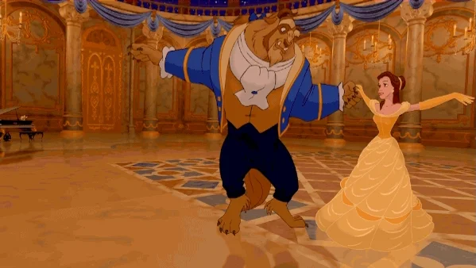

<style type="text/css">
.pull-left {
  margin-top: -25px;
}
.pull-right {
  margin-top: -25px;
}
.remark-code {
    font-size: 14px;
}
.font17 {
    font-size: 17px;
}
.font14 {
    font-size: 14px;
}
</style>


```{r databases-2-1, include = FALSE}
knitr::opts_chunk$set(cache = TRUE, comment = "")

library(tidyverse)
library(DBI)
library(dm)

options(width = 68)

options(pillar.bold = TRUE)
options(cli.num_colors = 256)

fansi::set_knit_hooks(knitr::knit_hooks, c("output", "message", "warning", "error"))
```

```{r databases-2-2, results='hide', message=FALSE, cache = FALSE, include = FALSE}
con_duckdb <- dbConnect(duckdb::duckdb())
con_duckdb
```

```{r databases-2-3, cache = FALSE, include = FALSE}
dm::copy_dm_to(
  con_duckdb,
  dm::dm_pixarfilms(),
  set_key_constraints = FALSE,
  temporary = FALSE
)
```

```{r databases-2-4, cache = FALSE, include = FALSE}
pixar_films <- tbl(con_duckdb, "pixar_films")
pixar_films
```

```{r databases-2-5, cache = FALSE, include = FALSE}
con_sqlite <- DBI::dbConnect(RSQLite::SQLite(), extended_types = TRUE)
dm::copy_dm_to(
  con_sqlite,
  dm::dm_pixarfilms(),
  set_key_constraints = FALSE,
  temporary = FALSE
)
```

```{r databases-2-6, cache = FALSE, include = FALSE}
pixar_films_sqlite <- tbl(con_sqlite, "pixar_films")
pixar_films_sqlite
```

---

# Schedule

Extract ⇨ Transform ⇨ Load ⇨ Consume

.pull-left[
## One table

- Read whole tables
- Let the database do the heavy lifting
- Basic ETL for one table
- Subtle issues to watch out for
]

.pull-right[
## Multiple tables

- **Joins**
- The {dm} package
- A bit of theory
- Playing the whole game
]

## Bonus: Bring your own data + questions

---

background-image: url("images/21.webp")
background-size: 40%
background-position: 100% 100%

# Joins

.pull-left[
- Usage
- Join sources
- Mounting

Script: `databases_21.R`

```{r databases-2-7 }
library(tidyverse)
```
]

---

background-image: url("images/21-frame.webp")
background-size: 40%
background-position: 100% 100%

# Joins

.pull-left[
- Usage
- Join sources
- Mounting

Script: `databases_21.R`

```{r databases-2-8 }
library(tidyverse)
```
]

---

# A second table

.pull-left[
```{r databases-2-9, cache = FALSE}
academy <- tbl(con_duckdb, "academy")
academy_sqlite <- tbl(con_sqlite, "academy")

academy %>%
  count(status)
```
]

.pull-right[
```{r databases-2-10 }
academy
```
]

---

# Left join

The most frequent kind of join.

.pull-left[
## Unsafe

```{r databases-2-11 }
academy %>%
  left_join(pixar_films)
```
]

.pull-right[
## Better

```{r databases-2-12 }
academy %>%
  left_join(pixar_films, by = "film")
```
]

---

# Left join

Computed on the database, original data unchanged.

```{r databases-2-13 }
academy %>%
  left_join(pixar_films, by = "film") %>%
  show_query()
```

---

# Join with preparation

The right-hand side in the join should come from a variable.

.pull-left[
## Prepare RHS

```{r databases-2-14 }
academy_won <-
  academy %>%
  filter(status == "Won") %>%
  count(film, name = "n_won")
academy_won
```
]


.pull-right[
```{r databases-2-15 }
pixar_films %>%
  left_join(academy_won, by = "film")
```
]

---

# Join with postprocessing

.pull-left[
## Raw result

```{r databases-2-16 }
pixar_films %>%
  left_join(academy_won, by = "film") %>%
  arrange(release_date)
```
]


.pull-right[
## After postprocessing

```{r databases-2-17 }
pixar_films %>%
  left_join(academy_won, by = "film") %>%
  mutate(n_won = coalesce(n_won, 0L)) %>%
  arrange(release_date)
```
]

---

# Join with processing

Computed on the database, original data unchanged.

```{r databases-2-18 }
pixar_films %>%
  left_join(academy_won, by = "film") %>%
  mutate(n_won = coalesce(n_won, 0L)) %>%
  arrange(release_date) %>%
  show_query()
```

---

# Tables must be on the same source

Use `copy = TRUE` to enforce, the result is a lazy table if the LHS is a lazy table.

.pull-left[
## Bad

```{r databases-2-19 }
try(
  academy %>%
    left_join(pixar_films_sqlite, by = "film")
)
```
]

.pull-right[
## Not too bad

```{r databases-2-20 }
academy %>%
  left_join(pixar_films_sqlite, by = "film", copy = TRUE)
```
]

---

# Copying is expensive!

A temporary table is created on the LHS database.
If the RHS comes from a different database, results are temporarily loaded into the local session!

```{r databases-2-21 }
academy %>%
  left_join(pixar_films_sqlite, by = "film", copy = TRUE) %>%
  show_query()
```

---

# Joining data frames with lazy tables

The result is a data frame too.

.pull-left[
## Bad

```{r databases-2-22 }
try(
  pixarfilms::academy %>%
    left_join(pixar_films, by = "film")
)
```
]

.pull-right[
## Could be worse

```{r databases-2-23 }
pixarfilms::academy %>%
  left_join(pixar_films, by = "film", copy = TRUE)
```
]

---

# DuckDB: register data frames as database tables

Temporarily use a local data frame as a table.
Also works for Arrow datasets via `duckdb::duckdb_register_arrow()`.

.pull-left[
## Register and access

```{r databases-2-24 }
duckdb::duckdb_register(
  con_duckdb,
  "academy_small",
  pixarfilms::academy[1:3, ]
)

academy_small <- tbl(con_duckdb, "academy_small")
academy_small
```
]

.pull-right[
## Use

```{r databases-2-25 }
academy_small %>%
  left_join(pixar_films, by = "film")
```
]

---

# DuckDB: Performance comparison

Baseline: Data frames.

.pull-left[
```{r databases-2-26 }
nrow(nycflights13::flights)
```
]

.pull-right[
```{r databases-2-27 }
system.time(
  nycflights13::flights %>%
    count(year, month, day)
)
```
]

---

# DuckDB: Performance comparison

With registration.

.pull-left[
```{r databases-2-28 }
system.time(duckdb::duckdb_register(
  con_duckdb,
  "flights",
  nycflights13::flights
))

flights_register <- tbl(con_duckdb, "flights")
flights_register %>%
  count()
```
]

.pull-right[
```{r databases-2-29 }
system.time(
  flights_register %>%
    count(year, month, day) %>%
    collect()
)
```
]

---

# DuckDB: Performance comparison

With copy.

.pull-left[
```{r databases-2-30 }
system.time(
  flights_copy <- copy_to(con_duckdb, nycflights13::flights)
)

flights_copy %>%
  count()
```
]

.pull-right[
```{r databases-2-31 }
system.time(
  flights_copy %>%
    count(year, month, day) %>%
    collect()
)
```
]

---

# ETL, revisited

Insert a second table into our database.

```{r databases-2-32 }
db_path <- fs::path_abs("pixar.duckdb")
con <- DBI::dbConnect(duckdb::duckdb(dbdir = db_path))
DBI::dbWriteTable(con, "academy", pixarfilms::academy, overwrite = TRUE)
DBI::dbExecute(con, "CREATE UNIQUE INDEX academy_pk ON academy (film, award_type)")
DBI::dbExecute(con, "CREATE INDEX academy_fk ON academy (film)")
DBI::dbDisconnect(con)
```

---

background-image: url("images/21-frame.webp")
background-size: 40%
background-position: 100% 100%

# Joins: Exercises 1

.pull-left[
1. How many rows does the join between `academy` and `pixar_films` contain?
   Try to find out without loading all the data into memory. Explain.
2. Which films are not yet listed in the `academy` table? What does the
   resulting SQL query look like?
   - Hint: Use `anti_join()`
]

---

background-image: url("images/21-frame.webp")
background-size: 40%
background-position: 100% 100%

# Joins: Exercises 2

.pull-left[
3. Transform `academy` into a wide table so that there is at most one row
   per film. Join the resulting table with the `pixar_films` table.
   - Hint: Use `pivot_wider()`, `spread()`, `dcast()`, ... . You need to
     compute locally, because these functions don't work on the database.
]

.pull-right[
4. Plot a bar chart with the number of awards won and nominated per year.
   Compute as much as possible on the database.
   - Hint: "Long form" or "wide form"?
]

---

# Schedule

Extract ⇨ Transform ⇨ Load ⇨ Consume

.pull-left[
## One table

- Read whole tables
- Let the database do the heavy lifting
- Basic ETL for one table
- Subtle issues to watch out for
]

.pull-right[
## Multiple tables

- Joins
- **The {dm} package**
- A bit of theory
- Playing the whole game
]

## Bonus: Bring your own data + questions

---

background-image: url("images/22.webp")
background-size: 40%
background-position: 100% 100%

# Data models

.pull-left[
- Compound object for multiple tables
- Features

Script: `databases_22.R`

```{r databases-2-33 }
library(tidyverse)
library(dm)
```
]

---

background-image: url("images/22-frame.webp")
background-size: 40%
background-position: 100% 100%

# Data models

.pull-left[
- Compound object for multiple tables
- Features

Script: `databases_22.R`

```{r databases-2-34 }
library(tidyverse)
library(dm)
```
]

---

# Data model objects

.pull-left[
Store multiple tables in an object.

```{r databases-2-35 }
pixar_dm <- dm_pixarfilms()
pixar_dm
```

```{r databases-2-36, results="hide"}
pixar_dm %>%
  dm_draw()
```
]

.pull-right[
<!-- Generated by graphviz version 2.40.1 (20161225.0304)
 -->
<!-- Title: %0 Pages: 1 -->
<svg width="315pt" height="330pt"
 viewBox="-100.00 0.00 315.00 330.00" xmlns="http://www.w3.org/2000/svg" xmlns:xlink="http://www.w3.org/1999/xlink">
<g id="graph0" class="graph" transform="scale(1 1) rotate(0) translate(4 326)">
<title>%0</title>
<g id="a_graph0"><a xlink:title="Data Model">
<polygon fill="#ffffff" stroke="transparent" points="-4,4 -4,-326 211,-326 211,4 -4,4"/>
</a>
</g>
<!-- academy -->
<g id="node1" class="node">
<title>academy</title>
<polygon fill="#ed7d31" stroke="transparent" points="1.5,-301 1.5,-321 100.5,-321 100.5,-301 1.5,-301"/>
<text text-anchor="start" x="26.1255" y="-306.4" font-family="Times,serif" font-size="14.00" fill="#ffffff">academy</text>
<polygon fill="#fbe5d5" stroke="transparent" points="1.5,-281 1.5,-301 100.5,-301 100.5,-281 1.5,-281"/>
<text text-anchor="start" x="3.5" y="-286.4" font-family="Times,serif" font-size="14.00" fill="#444444">film</text>
<polygon fill="#fbe5d5" stroke="transparent" points="1.5,-261 1.5,-281 100.5,-281 100.5,-261 1.5,-261"/>
<text text-anchor="start" x="3.183" y="-267.4" font-family="Times,serif" text-decoration="underline" font-size="14.00" fill="#444444">film, award_type</text>
<polygon fill="none" stroke="#9e5320" stroke-opacity="0.666667" points="0,-260 0,-322 101,-322 101,-260 0,-260"/>
</g>
<!-- pixar_films -->
<g id="node4" class="node">
<title>pixar_films</title>
<polygon fill="#5b9bd5" stroke="transparent" points="138,-161 138,-181 206,-181 206,-161 138,-161"/>
<text text-anchor="start" x="139.7286" y="-166.4" font-family="Times,serif" font-size="14.00" fill="#ffffff">pixar_films</text>
<polygon fill="#deebf6" stroke="transparent" points="138,-141 138,-161 206,-161 206,-141 138,-141"/>
<text text-anchor="start" x="140" y="-147.4" font-family="Times,serif" text-decoration="underline" font-size="14.00" fill="#444444">film</text>
<polygon fill="none" stroke="#3c678e" stroke-opacity="0.666667" points="137,-140 137,-182 207,-182 207,-140 137,-140"/>
</g>
<!-- academy&#45;&gt;pixar_films -->
<g id="edge2" class="edge">
<title>academy:film&#45;&gt;pixar_films:film</title>
<path fill="none" stroke="#555555" d="M100.5,-291C161.0155,-291 84.073,-167.4399 127.9432,-152.4775"/>
<polygon fill="#555555" stroke="#555555" points="128.615,-155.9165 138,-151 127.5974,-148.9909 128.615,-155.9165"/>
</g>
<!-- box_office -->
<g id="node2" class="node">
<title>box_office</title>
<polygon fill="#ed7d31" stroke="transparent" points="18.5,-221 18.5,-241 82.5,-241 82.5,-221 18.5,-221"/>
<text text-anchor="start" x="20.1795" y="-226.4" font-family="Times,serif" font-size="14.00" fill="#ffffff">box_office</text>
<polygon fill="#fbe5d5" stroke="transparent" points="18.5,-201 18.5,-221 82.5,-221 82.5,-201 18.5,-201"/>
<text text-anchor="start" x="20.5" y="-207.4" font-family="Times,serif" text-decoration="underline" font-size="14.00" fill="#444444">film</text>
<polygon fill="none" stroke="#9e5320" stroke-opacity="0.666667" points="17.5,-200 17.5,-242 83.5,-242 83.5,-200 17.5,-200"/>
</g>
<!-- box_office&#45;&gt;pixar_films -->
<g id="edge3" class="edge">
<title>box_office:film&#45;&gt;pixar_films:film</title>
<path fill="none" stroke="#555555" d="M82.5,-211C114.9945,-211 104.6973,-162.9888 128.1654,-152.8615"/>
<polygon fill="#555555" stroke="#555555" points="128.8254,-156.2988 138,-151 127.5235,-149.4209 128.8254,-156.2988"/>
</g>
<!-- genres -->
<g id="node3" class="node">
<title>genres</title>
<polygon fill="#ed7d31" stroke="transparent" points="18.5,-161 18.5,-181 83.5,-181 83.5,-161 18.5,-161"/>
<text text-anchor="start" x="32.7328" y="-166.4" font-family="Times,serif" font-size="14.00" fill="#ffffff">genres</text>
<polygon fill="#fbe5d5" stroke="transparent" points="18.5,-141 18.5,-161 83.5,-161 83.5,-141 18.5,-141"/>
<text text-anchor="start" x="20.5" y="-146.4" font-family="Times,serif" font-size="14.00" fill="#444444">film</text>
<polygon fill="#fbe5d5" stroke="transparent" points="18.5,-121 18.5,-141 83.5,-141 83.5,-121 18.5,-121"/>
<text text-anchor="start" x="20.2889" y="-127.4" font-family="Times,serif" text-decoration="underline" font-size="14.00" fill="#444444">film, genre</text>
<polygon fill="none" stroke="#9e5320" stroke-opacity="0.666667" points="17,-120 17,-182 84,-182 84,-120 17,-120"/>
</g>
<!-- genres&#45;&gt;pixar_films -->
<g id="edge4" class="edge">
<title>genres:film&#45;&gt;pixar_films:film</title>
<path fill="none" stroke="#555555" d="M83.5,-151C103.9375,-151 111.4419,-151 127.8378,-151"/>
<polygon fill="#555555" stroke="#555555" points="128,-154.5001 138,-151 128,-147.5001 128,-154.5001"/>
</g>
<!-- pixar_people -->
<g id="node5" class="node">
<title>pixar_people</title>
<polygon fill="#70ad47" stroke="transparent" points="12.5,-81 12.5,-101 89.5,-101 89.5,-81 12.5,-81"/>
<text text-anchor="start" x="14.4572" y="-86.4" font-family="Times,serif" font-size="14.00" fill="#ffffff">pixar_people</text>
<polygon fill="#e2eeda" stroke="transparent" points="12.5,-61 12.5,-81 89.5,-81 89.5,-61 12.5,-61"/>
<text text-anchor="start" x="14.5" y="-66.4" font-family="Times,serif" font-size="14.00" fill="#444444">film</text>
<polygon fill="none" stroke="#4a732f" stroke-opacity="0.666667" points="11,-60 11,-102 90,-102 90,-60 11,-60"/>
</g>
<!-- pixar_people&#45;&gt;pixar_films -->
<g id="edge1" class="edge">
<title>pixar_people:film&#45;&gt;pixar_films:film</title>
<path fill="none" stroke="#555555" d="M89.5,-71C127.1813,-71 102.2491,-136.7031 128.1904,-149.0225"/>
<polygon fill="#555555" stroke="#555555" points="127.5055,-152.4547 138,-151 128.8889,-145.5928 127.5055,-152.4547"/>
</g>
<!-- public_response -->
<g id="node6" class="node">
<title>public_response</title>
<polygon fill="#ed7d31" stroke="transparent" points="3.5,-21 3.5,-41 97.5,-41 97.5,-21 3.5,-21"/>
<text text-anchor="start" x="5.0126" y="-26.4" font-family="Times,serif" font-size="14.00" fill="#ffffff">public_response</text>
<polygon fill="#fbe5d5" stroke="transparent" points="3.5,-1 3.5,-21 97.5,-21 97.5,-1 3.5,-1"/>
<text text-anchor="start" x="5.5" y="-7.4" font-family="Times,serif" text-decoration="underline" font-size="14.00" fill="#444444">film</text>
<polygon fill="none" stroke="#9e5320" stroke-opacity="0.666667" points="2.5,0 2.5,-42 98.5,-42 98.5,0 2.5,0"/>
</g>
<!-- public_response&#45;&gt;pixar_films -->
<g id="edge5" class="edge">
<title>public_response:film&#45;&gt;pixar_films:film</title>
<path fill="none" stroke="#555555" d="M97.5,-11C158.3517,-11 83.4456,-134.5601 127.8579,-149.5225"/>
<polygon fill="#555555" stroke="#555555" points="127.5999,-153.0217 138,-151 128.6091,-146.0949 127.5999,-153.0217"/>
</g>
</g>
</svg>
]

---

# Data model objects

Use like a named list.

```{r databases-2-37, echo = FALSE}
old <- options(width = 135)
```


```{r databases-2-38 }
names(pixar_dm)
```

```{r databases-2-39, echo = FALSE}
options(old)
```

.pull-left[
```{r databases-2-40 }
pixar_dm$pixar_films
```
]

.pull-right[
```{r databases-2-41 }
pixar_dm$academy
```
]

---

# Showcase: wrapping all tables in a data model

One of the many operations supported by {dm}.

.pull-left[
```{r databases-2-42 }
pixar_films_wrapped <-
  pixar_dm %>%
  dm_wrap_tbl(pixar_films) %>%
  pull_tbl(pixar_films)

pixar_films_wrapped
```
]

.pull-right[
```{r databases-2-43 }
pixar_films_wrapped$academy[1:2]
```
]

---

# Schedule

Extract ⇨ Transform ⇨ Load ⇨ Consume

.pull-left[
## One table

- Read whole tables
- Let the database do the heavy lifting
- Basic ETL for one table
- Subtle issues to watch out for
]

.pull-right[
## Multiple tables

- Joins
- The {dm} package
- **A bit of theory**
- Playing the whole game
]

## Bonus: Bring your own data + questions

---

background-image: url("images/23.webp")
background-size: 40%
background-position: 100% 100%

# Data models

.pull-left[
- Keys, relationships, constraints
- Zooming

Script: `databases_23.R`

```{r databases-2-44 }
library(tidyverse)
library(dm)
```
]

---

background-image: url("images/23-frame.webp")
background-size: 40%
background-position: 100% 100%

# Data models

.pull-left[
- Keys, relationships, constraints
- Zooming

Script: `databases_23.R`

```{r databases-2-45 }
library(tidyverse)
library(dm)
```
]

---

# Primary keys

Column(s) that uniquely identify rows in a table.

.pull-left[
```{r databases-2-46 }
any(duplicated(pixar_dm$pixar_films$film))
check_key(pixar_dm$pixar_films, film)
```
]

.pull-right[
```{r databases-2-47 }
any(duplicated(pixar_dm$academy[c("film", "award_type")]))
check_key(pixar_dm$academy, film, award_type)
try(
  check_key(pixar_dm$academy, film)
)
```
]

---

# Foreign keys

Column(s) that point to a primary key in another table.

```{r databases-2-48 }
all(pixar_dm$academy$film %in% pixar_dm$pixar_films$film)
check_subset(pixar_dm$academy, film, pixar_dm$pixar_films, film)
try(
  check_subset(pixar_dm$pixar_films, film, pixar_dm$academy, film)
)
```

---

# Constraints

Properties of primary and foreign keys can be checked.

```{r databases-2-49 }
pixar_dm %>%
  dm_examine_constraints()

dm_pixarfilms(consistent = TRUE) %>%
  dm_examine_constraints()
```

---

# Constraints

An example from another dataset.

```{r databases-2-50 }
dm_nycflights13() %>%
  dm_examine_constraints()
```

---

# Zooming

Focusing on one table in a dm object.
Allows applying data transformations on that table inside a dm object.

.pull-left[
```{r databases-2-51 }
pixar_dm %>%
  dm_zoom_to(academy)
```
]

.pull-right[
```{r databases-2-52 }
pixar_dm %>%
  dm_zoom_to(academy) %>%
  left_join(pixar_films, select = c(film, release_date))
```
]

---

# Flattening

Join a table to all related tables.

```{r databases-2-53, echo = FALSE}
old <- options(width = 135)
```

```{r databases-2-54 }
pixar_dm %>%
  dm_flatten_to_tbl(academy)
```

---

# Flattening

A larger example with a different dataset.

```{r databases-2-55 }
dm_nycflights13() %>%
  dm_select(weather, -year, -month, -day, -hour) %>%
  dm_flatten_to_tbl(flights)
```

```{r databases-2-56, echo = FALSE}
options(old)
```

---

# Schedule

Extract ⇨ Transform ⇨ Load ⇨ Consume

.pull-left[
## One table

- Read whole tables
- Let the database do the heavy lifting
- Basic ETL for one table
- Subtle issues to watch out for
]

.pull-right[
## Multiple tables

- Joins
- The {dm} package
- A bit of theory
- **Playing the whole game**
]

## Bonus: Bring your own data + questions

---

background-image: url("images/24.webp")
background-size: 40%
background-position: 100% 100%

# The whole game

.pull-left[
- Build a local data model
- Copy it to the database
- Consume it

Script: `databases_24.R`

```{r databases-2-57 }
library(tidyverse)
library(dm)
```
]

---

background-image: url("images/24-frame.webp")
background-size: 40%
background-position: 100% 100%

# The whole game

.pull-left[
- Build a local data model
- Copy it to the database
- Consume it

Script: `databases_24.R`

```{r databases-2-58 }
library(tidyverse)
library(dm)
```
]

---

background-image: url("images/magic-hat-and-wand-nath-r.svg")
background-size: 25%
background-position: 100% 100%

# Define transformed table

- Fix type of `number` column
- Extract `franchise` and `sequel` columns

```{r databases-2-59, echo = FALSE}
pixar_films_clean <-
  pixarfilms::pixar_films %>%
  filter(!is.na(film)) %>% 
  separate(film, into = c("franchise", "sequel"),
    sep = " (?=[0-9]+$)", fill = "right", remove = FALSE
  ) %>%
  mutate(across(c(number, sequel), as.integer)) %>%
  group_by(franchise) %>%
  mutate(sequel = if_else(is.na(sequel) & n() > 1, 1L, sequel)) %>%
  ungroup()
old <- options(width = 135)
```

```{r databases-2-60 }
pixar_films_clean
```

```{r databases-2-61, echo = FALSE}
options(old)
```

---

# Define dm object

Use `dm()` to create a dm object, pass tables (data frames or lazy tables).

```{r databases-2-62 }
base_dm <- dm(
  pixar_films = pixar_films_clean,
  academy = pixarfilms::academy,
  box_office = pixarfilms::box_office,
)
base_dm
```

---

# Add keys

Using `dm_add_pk()` and `dm_add_fk()`.

.pull-left[
```{r databases-2-63 }
full_dm <-
  base_dm %>%
  dm_add_pk(pixar_films, film) %>%
  dm_add_pk(box_office, film) %>%
  dm_add_fk(academy, film, pixar_films) %>%
  dm_add_fk(box_office, film, pixar_films)
full_dm
```
```{r databases-2-64, results="hide"}
full_dm %>%
  dm_draw(view_type = "all")
```
]

.pull-right[
<!-- Generated by graphviz version 2.40.1 (20161225.0304)
 -->
<!-- Title: %0 Pages: 1 -->
<svg width="252pt" height="230pt"
 viewBox="0.00 0.00 252.00 230.00" xmlns="http://www.w3.org/2000/svg" xmlns:xlink="http://www.w3.org/1999/xlink">
<g id="graph0" class="graph" transform="scale(1 1) rotate(0) translate(4 226)">
<title>%0</title>
<g id="a_graph0"><a xlink:title="Data Model">
<polygon fill="#ffffff" stroke="transparent" points="-4,4 -4,-226 248,-226 248,4 -4,4"/>
</a>
</g>
<!-- academy -->
<g id="node1" class="node">
<title>academy</title>
<polygon fill="#efebdd" stroke="transparent" points="32.5,-201 32.5,-221 101.5,-221 101.5,-201 32.5,-201"/>
<text text-anchor="start" x="42.1255" y="-206.4" font-family="Times,serif" font-size="14.00" fill="#000000">academy</text>
<polygon fill="#ffffff" stroke="transparent" points="32.5,-181 32.5,-201 101.5,-201 101.5,-181 32.5,-181"/>
<text text-anchor="start" x="34.5" y="-186.4" font-family="Times,serif" font-size="14.00" fill="#444444">film</text>
<polygon fill="#ffffff" stroke="transparent" points="32.5,-161 32.5,-181 101.5,-181 101.5,-161 32.5,-161"/>
<text text-anchor="start" x="34.3492" y="-166.4" font-family="Times,serif" font-size="14.00" fill="#444444">award_type</text>
<polygon fill="#ffffff" stroke="transparent" points="32.5,-141 32.5,-161 101.5,-161 101.5,-141 32.5,-141"/>
<text text-anchor="start" x="34.5" y="-146.4" font-family="Times,serif" font-size="14.00" fill="#444444">status</text>
<polygon fill="none" stroke="#555555" points="31,-140 31,-222 102,-222 102,-140 31,-140"/>
</g>
<!-- pixar_films -->
<g id="node3" class="node">
<title>pixar_films</title>
<polygon fill="#efebdd" stroke="transparent" points="170.5,-171 170.5,-191 243.5,-191 243.5,-171 170.5,-171"/>
<text text-anchor="start" x="174.7286" y="-176.4" font-family="Times,serif" font-size="14.00" fill="#000000">pixar_films</text>
<polygon fill="#ffffff" stroke="transparent" points="170.5,-151 170.5,-171 243.5,-171 243.5,-151 170.5,-151"/>
<text text-anchor="start" x="172.5" y="-156.4" font-family="Times,serif" font-size="14.00" fill="#444444">number</text>
<polygon fill="#ffffff" stroke="transparent" points="170.5,-131 170.5,-151 243.5,-151 243.5,-131 170.5,-131"/>
<text text-anchor="start" x="172.5" y="-137.4" font-family="Times,serif" text-decoration="underline" font-size="14.00" fill="#444444">film</text>
<polygon fill="#ffffff" stroke="transparent" points="170.5,-111 170.5,-131 243.5,-131 243.5,-111 170.5,-111"/>
<text text-anchor="start" x="172.5" y="-116.4" font-family="Times,serif" font-size="14.00" fill="#444444">franchise</text>
<polygon fill="#ffffff" stroke="transparent" points="170.5,-91 170.5,-111 243.5,-111 243.5,-91 170.5,-91"/>
<text text-anchor="start" x="172.5" y="-96.4" font-family="Times,serif" font-size="14.00" fill="#444444">sequel</text>
<polygon fill="#ffffff" stroke="transparent" points="170.5,-71 170.5,-91 243.5,-91 243.5,-71 170.5,-71"/>
<text text-anchor="start" x="172.413" y="-76.4" font-family="Times,serif" font-size="14.00" fill="#444444">release_date</text>
<polygon fill="#ffffff" stroke="transparent" points="170.5,-51 170.5,-71 243.5,-71 243.5,-51 170.5,-51"/>
<text text-anchor="start" x="172.5" y="-56.4" font-family="Times,serif" font-size="14.00" fill="#444444">run_time</text>
<polygon fill="#ffffff" stroke="transparent" points="170.5,-31 170.5,-51 243.5,-51 243.5,-31 170.5,-31"/>
<text text-anchor="start" x="172.5" y="-36.4" font-family="Times,serif" font-size="14.00" fill="#444444">film_rating</text>
<polygon fill="none" stroke="#555555" points="169,-30 169,-192 244,-192 244,-30 169,-30"/>
</g>
<!-- academy&#45;&gt;pixar_films -->
<g id="edge1" class="edge">
<title>academy:film&#45;&gt;pixar_films:film</title>
<path fill="none" stroke="#555555" d="M101.5,-191C135.5254,-191 133.5378,-150.6405 160.2481,-142.4425"/>
<polygon fill="#555555" stroke="#555555" points="161.0852,-145.8593 170.5,-141 160.1099,-138.9275 161.0852,-145.8593"/>
</g>
<!-- box_office -->
<g id="node2" class="node">
<title>box_office</title>
<polygon fill="#efebdd" stroke="transparent" points="1.5,-101 1.5,-121 132.5,-121 132.5,-101 1.5,-101"/>
<text text-anchor="start" x="36.6795" y="-106.4" font-family="Times,serif" font-size="14.00" fill="#000000">box_office</text>
<polygon fill="#ffffff" stroke="transparent" points="1.5,-81 1.5,-101 132.5,-101 132.5,-81 1.5,-81"/>
<text text-anchor="start" x="3.5" y="-87.4" font-family="Times,serif" text-decoration="underline" font-size="14.00" fill="#444444">film</text>
<polygon fill="#ffffff" stroke="transparent" points="1.5,-61 1.5,-81 132.5,-81 132.5,-61 1.5,-61"/>
<text text-anchor="start" x="3.5" y="-66.4" font-family="Times,serif" font-size="14.00" fill="#444444">budget</text>
<polygon fill="#ffffff" stroke="transparent" points="1.5,-41 1.5,-61 132.5,-61 132.5,-41 1.5,-41"/>
<text text-anchor="start" x="3.5" y="-46.4" font-family="Times,serif" font-size="14.00" fill="#444444">box_office_us_canada</text>
<polygon fill="#ffffff" stroke="transparent" points="1.5,-21 1.5,-41 132.5,-41 132.5,-21 1.5,-21"/>
<text text-anchor="start" x="3.5" y="-26.4" font-family="Times,serif" font-size="14.00" fill="#444444">box_office_other</text>
<polygon fill="#ffffff" stroke="transparent" points="1.5,-1 1.5,-21 132.5,-21 132.5,-1 1.5,-1"/>
<text text-anchor="start" x="3.2447" y="-6.4" font-family="Times,serif" font-size="14.00" fill="#444444">box_office_worldwide</text>
<polygon fill="none" stroke="#555555" points="0,0 0,-122 133,-122 133,0 0,0"/>
</g>
<!-- box_office&#45;&gt;pixar_films -->
<g id="edge2" class="edge">
<title>box_office:film&#45;&gt;pixar_films:film</title>
<path fill="none" stroke="#555555" d="M132.5,-91C156.2685,-91 146.8719,-127.2579 160.7946,-138.022"/>
<polygon fill="#555555" stroke="#555555" points="159.9132,-141.4126 170.5,-141 161.9666,-134.7205 159.9132,-141.4126"/>
</g>
</g>
</svg>
]

---

# ETL, revisited

All tables and keys in a dm object can be copied in one swoop.

```{r databases-2-65 }
db_path <- fs::path_abs("pixar.duckdb")
fs::file_delete(db_path)
con <- DBI::dbConnect(duckdb::duckdb(dbdir = db_path))
pixar_dm_duckdb <- copy_dm_to(con, full_dm, temporary = FALSE)
pixar_dm_duckdb
```

---

# ETL, revisited

The `temporary = FALSE` argument ensures that tables are permanent.

```{r databases-2-66, echo = FALSE}
old <- options(width = 135)
```

```{r databases-2-67 }
pixar_dm_duckdb$pixar_films
```


---

# ETL, revisited

Operations on the database dm work the same as for the local dm.

```{r databases-2-68 }
pixar_dm_duckdb %>%
  dm_flatten_to_tbl(academy)
```

---

# Consume, revisited

Keys are not (yet) loaded for DuckDB.
This works better for SQL Server and Postgres.

```{r databases-2-69 }
DBI::dbDisconnect(con)

con <- DBI::dbConnect(duckdb::duckdb(dbdir = db_path))
pixar_dm_learned <- dm_from_src(con)
pixar_dm_learned
```

```{r databases-2-70, echo = FALSE}
options(old)
```

---

# Consume, revisited

Implement a helper function for your data model.

.pull-left[
```{r databases-2-71 }
dm_pixarfilms_small <- function() {
  db_path <- fs::path_abs("pixar.duckdb")
  con <- DBI::dbConnect(duckdb::duckdb(dbdir = db_path))
  table_names <- c("academy", "box_office", "pixar_films")
  dm_from_src(
    con, 
    table_names = table_names, 
    learn_keys = FALSE
  ) %>%
    dm_add_pk(pixar_films, film) %>%
    dm_add_pk(box_office, film) %>%
    dm_add_fk(academy, film, pixar_films) %>%
    dm_add_fk(box_office, film, pixar_films)
}
```
]

.pull-right[
```{r databases-2-72 }
dm_pixarfilms_small()
```
]

---

# Consuming with dm

Create a new derived table in the dm object.

.pull-left[
```{r databases-2-73 }
my_dm <- dm_pixarfilms_small()
my_helper_dm <-
  my_dm %>%
  dm_zoom_to(academy) %>%
  filter(status == "Won") %>%
  count(film, name = "n_awards_won") %>%
  dm_insert_zoomed("academy_won")
```
]

.pull-right[
```{r databases-2-74 }
my_helper_dm
```
]

---

# Consuming with dm

Use the derived table to cross-reference box office and awards won per film.

.pull-left[
```{r databases-2-75 }
box_office_vs_awards <-
  my_helper_dm %>%
  dm_zoom_to(pixar_films) %>%
  left_join(
    box_office, 
    select = c(film, box_office_worldwide)
  ) %>%
  left_join(academy_won) %>%
  transmute(
    rating = film_rating,
    box_office_mln = box_office_worldwide / 1e6,
    n_awards_won = coalesce(n_awards_won, 0)
  ) %>%
  pull_tbl() %>%
  collect()
```
]

.pull-right[
```{r databases-2-76 }
box_office_vs_awards
```
]

---

# Consuming with dm

```{r databases-2-77, message=FALSE, warning=FALSE, fig.width=12, fig.height=5}
ggplot(box_office_vs_awards, aes(x = box_office_mln, y = n_awards_won)) +
  geom_smooth() +
  geom_point() +
  facet_wrap(vars(rating)) +
  theme_bw(20)
```

---

# Recap

<table>
<tr>
<td rowspan=2>

</td>
<td></td>
<td></td>
<td></td>
<td></td>
</tr>
<tr style="background:transparent">
<td></td>
<td></td>
<td></td>
<td></td>
</tr>
</table>

---

# Schedule

Extract ⇨ Transform ⇨ Load ⇨ Consume

.pull-left[
## One table

- Read whole tables
- Let the database do the heavy lifting
- Basic ETL for one table
- Subtle issues to watch out for
]

.pull-right[
## Multiple tables

- Joins
- The {dm} package
- A bit of theory
- Playing the whole game
]

## Bonus: Bring your own data + questions
