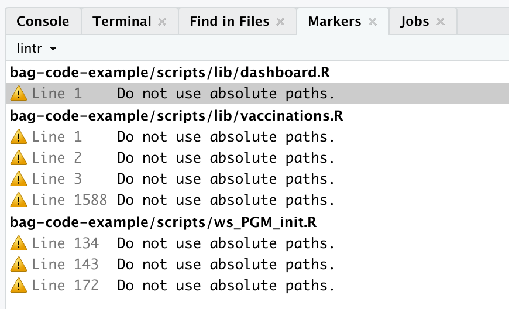

```{r setup, include=FALSE}
knitr::opts_chunk$set(echo = TRUE)
```

## Provided information

* We were provided a sample of the code along with sample data and some information
on how to run it
* We were also provided access to the full code repository
* We provide presentation slides outlining general steps that can be applied on
a project such as this one, and we apply them as we go through the presentation

## Fix code

### `check_files_parse()`

We run The following to make sure that all files are syntactic R code:

```{r, eval = FALSE}
# github::install_github("cynkra/bagtools")
bagtools::check_files_parse()
```

In our sample project this prints "All R scripts contain syntactic codes"

In the bigger project we find some issues


We see we have 2 scripts that don't parse, and one parse that contains RData
stored as an R script.

We can navigate to those scripts easily.

We comment out these problematic scripts, if we use version control we can 
remove them and we can get them back later if needed.

We correct the extension of the RData file.

When we run the function again, we get a clean result.


### The `sys.frame(1)$ofile` idiom

We find this idiom in the code, for instance in `ws_PGM_init.R` :

```{r, eval = FALSE}
# Get relative path where script is located ----
# Warning - First you must source this script in Rstudio (CTRL - SHIFT - ENTER)
script_path_01 <- sys.frame(1)$ofile
dir_sources <- paste0(dirname(script_path_01), "/")
```

The aim seems to be to get the path, of the scripts, but it uses a dirty RStudio
trick that is not flexible as the comment warns.

CTRL - SHIFT - F shows me `script_path_01` is not used anywhere else, so we can
change the code to :

```{r, eval = FALSE}
dir_sources <- here::here("bag-code-example/scripts")
```

Or even simply the following, since we don't have other calls to `setwd()`
in the code so relative paths will be "well behaved"

```{r, eval = FALSE}
dir_sources <- "bag-code-example/scripts"
```

In any case `dir_sources` is not used further in the code so we don't need this code at all.

### Absolute paths

We run `lintr::lint_dir(linters = lintr::absolute_path_linter())` to make sure we're
not using absolute paths. We find a few.


This instruction might take long to run on the huge code base, better call it on seperate folders or
files one by one. e.g.

```{r, eval = FALSE}
lintr::lint_dir("MM_stack", linters = lintr::absolute_path_linter())
```

In the sample project we find a single use of `setwd()` but in the bigger project we have 30 uses of `setwd()`, it would be good to sort them out and use only paths relative to the project folder.

My recommendation is to :

* Always use paths relative to project root for files that are contained in project
* Use `file.path(external_data_dir, "my_file.ext")` for external data (with `external_data_dir` defined either
as an environment variable, an option, or contained in a config file, we'll see those later)
* If we can't get rid of all `setwd()` and fix associated paths in one pass, consider
  using `here::here()` around relative paths so they won't be affected if another script changes the
  project directory.

### Dependencies : library calls

We make sure our library calls are not scattered through the code, and they aren't:

```{r, eval = FALSE}
lint_dir(linters = undesirable_function_linter(
  c(library = NA, require = NA)
))
```

We recommend to put the library call before sourcing the scripts however.
This is not important if we are sourcing functions only.

### Dependencies : conflicted

We can use the package conflicted to be safer about our function use.

We already know we'll be using `dplyr::filter` so we also call `conflict_prefer("filter", "dplyr")`

right after our call to tidyverse.

Let's put these library calls on top, and let's use the conflicted package to
make sure we don't use the wrong function by accident

```{r, eval = FALSE}
library(conflicted)
library(tidyverse)
conflict_prefer("filter", "dplyr")
library(janitor)
library(lubridate)
library(tictoc)
library(zoo)
```

### Dependencies : tidyverse

We replace tidyverse with its independent packages

```{r, eval = FALSE}
library(conflicted)
library(ggplot2)
library(tibble)
library(tidyr)
library(readr)
library(purrr)
library(dplyr)
conflict_prefer("filter", "dplyr")
library(stringr)
library(forcats)
library(janitor)
library(lubridate)
library(tictoc)
library(zoo)
```

### Dependencies : tidyverse

We use `bagtools::find_pkg_funs` to check what we really need from all of these packages

```{r, eval = FALSE}
# we use a lot of functions, we can keep the library call as is
# we can use library(,include.only=) if we  want to prepare to switch to a package
bagtools::find_pkg_funs("dplyr", exclude = "%>%") 
bagtools::find_pkg_funs("lubridate", exclude = "date") # `date()` is a false positive here
bagtools::find_pkg_funs("tictoc") 

# used in only one place but would be ugly with `::`, use library(,include.only=) ?
bagtools::find_pkg_funs("ggplot2") 

# not used much, consider converting to `::`
bagtools::find_pkg_funs("tibble", exclude = "%>%")
bagtools::find_pkg_funs("stringr", exclude = "%>%")
bagtools::find_pkg_funs("forcats", exclude = "%>%")
bagtools::find_pkg_funs("janitor", exclude = "%>%")
bagtools::find_pkg_funs("zoo", exclude = "%>%")

# not used
bagtools::find_pkg_funs("readr") 
bagtools::find_pkg_funs("purrr", exclude = "%>%")
```

### Dependencies : Make sure they are installed

`bagtools::use_namespace_check()` provides code that checks if required namespaces
are installed. We can place this code right below our library calls.

```{r, eval = FALSE}
required_pkgs <-
  c("assertthat", "bag.epi.dboard.etl", "bag.epi.io", "bag.epi.shapes", 
  "data.table", "dplyr", "dtplyr", "forcats", "httr", "janitor", 
  "lubridate", "openxlsx", "padr", "plyr", "purrr", "readr", "stringr", 
  "tidyr", "zoo")
for (pkg in required_pkgs) {
  requireNamespace(pkg)
}
```

We find here a couples packages that we don't have, luckily the need functions
we provided so we can edit the code to be able to run it.

## Code structure

### Nested source calls

We can take a look at how scripts are linked to each other by using `bagtools::flow_view_source_calls()`

We see for our small project some files are sourced several times.

`dates.R`  is not sourced in the init script but sourced in both
`dashboard.R` and `vaccinations.R` (itself sourcing `dashboard.R`).

`dates.R` contains a couple functions and nothing more, nothing prevents us from moving the source call to the init script and remove calls in `vaccinations.R` and `dashboard.R`. 

`versions.R` contains a single function and `dashboard` defines some constants (not depending on other variables) and some functions. This means they can be sourced only once, so we
can remove source calls from `vaccinations.R` since we have them already in `init`

On our big project the diagram is a lot bigger, we can call `bagtools::flow_view_source_calls(out = "pdf")` to get a readable map.

It allows us to see in particular :
* Which are the top level scripts
* Which scripts should be refactored in priority

A script that is sourced many times is a sign that either:
* This file contains code that should be refactored into a function
* This script contains functions that should be sourced once at the beginning

These scripts might also be refactored into sub packages.

### Isolate function definitions

We run `bagtools::identify_hybrid_scripts()` to see if we have scripts that mix
functions and other code.

We address these by :

* moving source calls to the top level (done at last step already)
* moving functions polluting functions to separate scripts (here our isoweek function)
* Dealing with global variables in a better way, here we have `dashboard.phase` objects
that are used by a single function, the easier way is to just define those inside of the function.

### Functions to scripts : inspect variables

Lets take a look at the `"ws_PGM_372_make_dfs_rKTN_impfmonitoring.R"` script.

By calling the following we can see at the top every instance of variable being used in the script.
There are a lot of false positives because of NSE (non standard evaluation).
Functions from other packages are also shown unless the package is attached, then they are recognized and hidden.

```{r, eval = FALSE}
bagtools::inspect_variables("bag-code-example/ws_PGM_372_make_dfs_rKTN_impfmonitoring.R")
```

The "i" icons describes variables that have been defined in the main script and were not
defined befor (in another script or higher in our main script).
The "x" icons describe variables that were defined in other scripts and yet were modified
in the main script, this is a behavior better avoided since it leads to situations
where the value of a variable depends on which scripts were run, which can create
confusion and mistakes.

### Functions to scripts : inspect output variables

There is a bit too much to see here though, let's focus on identifying the outputs of this script,
and show only the first occurrence of a variable in every script.

```{r, eval = FALSE}
bagtools::inspect_variables("bag-code-example/scripts/ws_PGM_372_make_dfs_rKTN_impfmonitoring.R", only_first = TRUE, focus = "outputs")
```

We now see only variables that have been created or modified by the script, along with
their use in other scripts, these are the potential outputs of our future function.

We still have a lot, but we can see that not many of those are used by other scripts.
In fact there is only one, `daily_raw_vaccination_data`, this will be our output then.

Note : seeing the code we realize this code had several other inputs that are probably
used by the real code, but we'll play along, these variables are not used here so are not
an output.

### Functions to scripts : inspect input variables

Now we can try to figure out our inputs 

```{r, eval = FALSE}
bagtools::inspect_variables("bag-code-example/scripts/ws_PGM_372_make_dfs_rKTN_impfmonitoring.R", only_first = TRUE, focus = "inputs")
```

Here we don't show variables that have been defined in our script, since they couldn't be inputs,
and we see where our candidates have been defined or modified.

Among our potential inputs, which show many false positives, we find that some of them
were defined in other scripts, these are our real inputs. However we note that many of those
are functions, these have a constant definition and it doesn't make much sense to
have them as formal inputs, so we don't consider them as inputs.

The remaining inputs are :
 * daily_raw_vaccination_data
 * f_altersklassen_meta   
 * current_date
 * bfs_pop
 * bfs_pop_ktn
 * bfs_pop_ktn_akl
 * vollstaendigkeitsmarkierung

### Functions to scripts : build a function

Thus we can build a function : 

```{r, eval = FALSE}
update_validation_data <- function(
  daily_raw_vaccination_data,
  f_altersklassen_meta,
  current_date,
  bfs_pop,
  bfs_pop_ktn,
  bfs_pop_ktn_akl,
  vollstaendigkeitsmarkierung) {
  # The existing code
  
  daily_raw_vaccination_data
} 
```

This function can be put in its own file, sourced at the top of the main script,
and then we can replace the whole script with :

```{r, eval = FALSE}
daily_raw_vaccination_data <- update_validation_data(
  daily_raw_vaccination_data,
  f_altersklassen_meta,
  current_date,
  bfs_pop,
  bfs_pop_ktn,
  bfs_pop_ktn_akl,
  vollstaendigkeitsmarkierung)
```

There are things that can be improved further, but we already have something that works.

### Functions to scripts : improve the function

Some things that can be improved :
* now that we don't have to worry about name collision anymore, and since the function
name (and maybe later the doc) gives us context, we can rename these arguments to 
be simpler
* We see that current_date is defined as `lubridate::today()`, we might not need to define something so simple separately. We can use it directly in the function, or maybe better, rename the
`current_date` argument to `date` and have a default `date = lubridate::today()` so we
can test this function with any date, which might be useful for debugging or unit tests,
and yet no need to mention it explicitly in our project code
* We saw that some objects in this function are defined but end up not being used to build
the output. We can see those graphically using the function `flow::flow_view_vars()`

```{r, eval = FALSE}
flow::flow_view_vars(update_validation_data)
```

This shows us the flow of variable definition and modifications, starting from
the arguments and ending at the green circle which symbolizes the output.

Whatever is in a dashed block is either dead code or code used for side effects,
including possible error messages. Here we see we could trim a lot of code.

We are still afraid to do mistakes though, the package {refactor} and the function `%refactor_value%` can help with this. The syntax works as follow :

```{r, eval = FALSE}
my_fun <- function(...) {
  # original body, which we won't touch
} %refactor_value% {
  # updated body, TBD
}
```

When function defined as above is called, both original and updated bodies will
be executed, without interfering. And we will see a helpful error if they don't return the same thing.

Let's try it with our function here.

Once we've trimmed it down and tested it we can remove the original code.

Then we can try another round of `flow::flow_view_vars()`, this shows clearly which
arguments are not used, so we can remove them easily.

### Functions to packages

We already have functions in the lib folder, organized by theme/scope.

We can move each of those to a separate package with very small work and
improve from there. Let's try it with a couple files.

`dates.R` is the easiest, let's also try `vaccination` and see what happens.


## Config file

We find some instances of variables in the code which might be nicely defined
as parameters in a configuration file. For instance :

`dashboard.assign_timeframes()` uses the following dates :

```{r, eval = FALSE}
dashboard.phase2_start <- lubridate::ymd("2020-06-08")
dashboard.phase2b_start <- lubridate::ymd("2020-09-28")
dashboard.phase3_start <- lubridate::ymd("2021-02-15")
dashboard.phase4_start <- lubridate::ymd("2021-06-21")
dashboard.phase5_start <- lubridate::ymd("2021-10-11")
```

What if we want to add a phase ? These values might be too constant to be used
as explicit arguments at every call of the function, but they also might be 
variable enough not to be hardcoded in code that is deemed to become obsolete
as soon as these values need to be updated.

In this other example below we have some values rigidly encoded, we might make
this code more flexible.

```{r, eval = FALSE}
vaccinations.get_azure_token <- function(password) {
  tenantId <- "beee95bb-7bef-4392-95b3-c42fd7305a53"
  clientId <- "90c57945-80fe-4621-9745-a02623eb466e"
  username <- "ag-lage@edibag.onmicrosoft.com"
  # ...
}
```

Finally below we find some production and test settings, also hardcoded,
which would nicely fit a config file canevas.

```{r, eval = FALSE}
vaccinations.download_csv <- function(token,
                                      api = "v2",
                                      dataset = "full",
                                      environment = "prod",
                                      ext=".csv",
                                      compression = ".gz") {
  if (environment == "prod") {
    env_url <- "https://ws.impfmonitoring.admin.ch/api/"
  } else if (environment == "test") {
    env_url <- "https://api-vmdl-nch-test-01.azure-api.net/api/"
  } else {
    stop("Environment must be 'test' or 'prod'")
  }
  # ...
}
```

We would get a config file like this one :

```
default:
  phases:
    phase2:  2020-06-08
    phase2b: 2020-09-28
    phase3:  2021-02-15
    phase4:  2021-06-21
    phase5:  2021-10-11
  azure:
    tenantId: beee95bb-7bef-4392-95b3-c42fd7305a53
    clientId: 90c57945-80fe-4621-9745-a02623eb466e
    username: ag-lage@edibag.onmicrosoft.com

prod:
  api url: https://ws.impfmonitoring.admin.ch/api/
  
test:
  api url: https://api-vmdl-nch-test-01.azure-api.net/api/
```

And our functions might become (after a bit of refactoring):

```{r, eval = FALSE}
dashboard.assign_timeframes <- function(
  dataframe, 
  current_date = lubridate::today(), 
  phases = config::get("phases")
  ) {
  names(phases) <- paste0("timeframe_", names(phases))
  dataframe %>%
    dplyr::mutate(
      timeframe_14d = ifelse(date >= current_date - lubridate::days(14) & date != current_date, TRUE, FALSE),
      timeframe_28d = ifelse(date >= current_date - lubridate::days(28) & date != current_date, TRUE, FALSE),
      timeframe_all = TRUE,
      # mutate accepts data frames, this builds a data frame with as many columns as phases
      map_dfc(phases, ~ date > lubridate::as_date(.))
    )
}
```

```{r, eval = FALSE}
vaccinations.get_azure_token <- function(password, azure_config = config::get("azure")) {
  tenantId <- azure_config$tenantId
  clientId <- azure_config$clientId
  username <- azure_config$username
  # ...
}
```

```{r, eval = FALSE}
vaccinations.download_csv <- function(token,
                                      api = "v2",
                                      dataset = "full",
                                      environment = c("prod", "test"),
                                      ext=".csv",
                                      compression = ".gz") {
  environment <- match.arg(environment)
  env_url <- config::get("api url", config = environment)
  # ...
}

# OR the following, and have R_CONFIG_ACTIVE set in .Renviron to "prod" or "test" 
vaccinations.download_csv <- function(token,
                                      api = "v2",
                                      dataset = "full",
                                      env_url = config::get("api url"),
                                      ext=".csv",
                                      compression = ".gz") {
  # ...
}
```

This config file would also be a good place to provide the path to an external
data folder. If it was user specific we could something like `data folder: !expr getOption("data_folder")` and have `options(data_folder = "my/folder")` in
your use ".Rprofile". Or we could do the same with environment variables and have
`data folder: !expr Sys.getenv("DATA_FOLDER")` in the config file and `DATA_FOLDER=my/folder` in your user `.Renviron`.

## Robust code

## Don't forget to ungroup!

`bagtools::detect_ambiguous_summarize_calls()` gives us a list of summarize
calls that we might want to add `.groups = "drop"` to.


## Cleaning data before joins is better than cleaning after 

We see this in the code : 

```{r, eval = FALSE}
# data wrangling ---------------------------------------------------------------------------------
# add shots_until_complete_vaccination to daily_raw_vaccination_data
daily_raw_vaccination_data <-
  daily_raw_vaccination_data %>%
  vaccinations.vacc_id_to_vaccine()

# some joining issue occurrs with suffixed but non-unique columns;
# fix by renaming
daily_raw_vaccination_data <-
  daily_raw_vaccination_data %>% 
  rename(vaccine = vaccine.y,
         shots_until_complete_vacc = shots_until_complete_vacc.y)
```

This second step is not necessary if we make `vaccinations.vacc_id_to_vaccine()`
cleaner. 

First we need to be really sure of what we're doing, we have conflicting info
here. The original data and the joined data don't show the same vaccines for
the same vaccine id.

We assume that the behavior occuring at the moment is right and we clean up 
the original function.

```
vaccinations.vacc_id_to_vaccine <- function(df) {
  # Remove obsolete vaccine column before joining from `vaccinations.known_vaccines()`
  df$vaccine <- NULL
  df_vacc_id <- df %>%
    dplyr::left_join(vaccinations.known_vaccines(), by = c("vacc_id"))
  return(df_vacc_id)
}
```

## Watch out for duplicated functions!

Avoid developing the same functionality twice as it might be tough to sort it out
later.

In the code we find in `dates.R` : 

```{r, eval = FALSE}
dates.isoyearweek <- function(date) {
  lubridate::isoyear(date) * 100 + lubridate::isoweek(date)
}
```

In `ws_PGM_372_make_dfs_rKTN_impfmonitoring.R` we find :

```{r, eval = FALSE}
isoyearweek <- function(datum) {
  jahrwoche <- lubridate::isoyear(datum) * 100 + lubridate::isoweek(datum)
  return(jahrwoche)
}
```

We propose to use `dates.isoyearweek()` since it is a general function

### Too much commented code

Some commented code is OK for some work in progress or some issues that might be solved
in the short term but having a lot of commented code is worrisome.

I really hope these comments are not toggled on and off for different use cases,
if this is the case we should have either :

* A boolean argument to the function, which might need to be added to all functions 
 that would call it, and forwarded properly
* An option, or a flag in a config file, to toggle the behavior on and off

Here I assume commented code is not needed so I'll just remove it

### Unfinished harmonization

When tackling a task that might take time and that might introduce errors,
or might be paused due to some different priorities coming. It's very useful
to use version control, a new feature will be developed on a new branch, and will be merged
back to the main branch once it's done, and ideally well tested.

If no version control infrastructure is in place yet we need to be careful or
we might end up with some half finished jobs that will clutter the project.

Here we have a function `f_make_age_groups` which seems to be aimed at
generalizing a task that we often find in the scripts.

```{r, eval = FALSE}
f_make_age_groups <- function (df, age_var = altersjahr, age_breaks = c(0, 10, 20,
                                                                        30, 40, 50, 60, 70, 80, Inf), new_age_var_name = altersklasse_covid19,
                               drop_undefined = FALSE) {
  ...
}

```


In the `vaccinations.R` script I find : 

```{r, eval = FALSE}

# FIXME: as soon as the function bag.epi.dboard.etl::f_make_age_groups is
# available, the two following functions can be replaced by it
vaccinations.add_akl_pdp_detailed <- function(df = df, .age_var){ # for age groups 12-15, 16-19 etc.
  df <- df %>%
    mutate(altersklasse_pdp = cut({{.age_var}},
                                  breaks = c(0,11, 15, 19, 29, 39, 49, 59, 69, 79, Inf),
                                  labels = c("0 - 11",
                                             "12 - 15",
                                             "16 - 19",
                                             "20 - 29",
                                             "30 - 39",
                                             "40 - 49",
                                             "50 - 59",
                                             "60 - 69",
                                             "70 - 79",
                                             "80+"),
                                  include.lowest = TRUE,
                                  exclude = NULL),
           altersklasse_pdp = forcats::fct_explicit_na(altersklasse_pdp, na_level = "Unbekannt")
    )
}

vaccinations.add_akl_pdp_summary <- function(df = df, .age_var){ # for age groups 12-19 etc.
  df <- df %>%
    mutate(altersklasse_pdp = cut({{.age_var}},
                                  breaks = c(0,11, 19, 29, 39, 49, 59, 69, 79, Inf),
                                  labels = c("0 - 11",
                                             "12 - 19",
                                             "20 - 29",
                                             "30 - 39",
                                             "40 - 49",
                                             "50 - 59",
                                             "60 - 69",
                                             "70 - 79",
                                             "80+"),
                                  include.lowest = TRUE,
                                  exclude = NULL),
           altersklasse_pdp = forcats::fct_explicit_na(altersklasse_pdp, na_level = "Unbekannt")
    )
}

```

And yet in the code I have calls like :

```{r, eval = FALSE}
... %>%
  mutate(
         altersklasse_covid19 = cut(person_age,
                                     breaks = c(0,9, 19, 29, 39, 49, 59, 69, 79, Inf),
                                     labels = c("0 - 9",
                                                "10 - 19",
                                                "20 - 29",
                                                "30 - 39",
                                                "40 - 49",
                                                "50 - 59",
                                                "60 - 69",
                                                "70 - 79",
                                                "80+"),
                                     include.lowest = TRUE,
                                     exclude = NULL)
  )

```

So it does seem that we have 3 "generations" of solving an issue coexisting together.

### Single source of truth

Additionally I see that we have a redundancy, the breakup of ages for `altersklasse_covid19`
is given in 2 instances

in `f_altersklassen_meta`

```{r, eval = FALSE}
names_list <- c("altersklasse_sti", "altersklasse_influ",
                "altersklasse_covid19", # <- this one
                "altersklasse_covid_5er",
                "altersklasse_covid_20er", "altersklasse_kind_erwachsene_pensioniert",
                "altersklasse_minderjaehrig_2_12_18", "altersklasse_minderjaehrig_2_5_9_12_16_18",
                "altersklasse_schule")

breaks_list <- list(
  c(0, 15, 25, 35, 45, 55, 65, Inf),
  c(0, 5, 15, 30, 65, Inf),
  c(seq(0, 80, by = 10),Inf), # <- this one
  c(seq(0, 95, by = 5), Inf),
  c(seq(0, 80, by = 20), Inf), 
  c(0, 18, 65, Inf), c(0, 2, 12, 18, Inf),
  c(0, 2, 5, 9, 12, 16, 18, Inf),
  c(0, 4, 6, 13, 16, 19, seq(30, 80, by = 5), Inf))
```

And in the default of `f_make_age_groups`

```{r, eval = FALSE}
f_make_age_groups <- function (
  df, age_var = altersjahr, 
  age_breaks = c(0, 10, 20, 30, 40, 50, 60, 70, 80, Inf), 
  new_age_var_name = altersklasse_covid19,
  drop_undefined = FALSE) {...}
```

If one of them was right and the other wrong, this would be hard to track because
some reports would be correct, other wouldn't.

If this needs to be updated at some point the developper will need to know there are
2 places to update, it's better to avoid this.


### Minor issue : style consistency

Some style guide recommend using explicit `return()` calls at the end of functions.

Most recommend NOT using those, since they're not needed.

This code base uses both ways and could be harmonized

### Minor issue : tidyselect warning

When I run the script I get some warnings

> Note: Using an external vector in selections is ambiguous.
> ℹ Use `all_of(.x)` instead of `.x` to silence this message.
> ℹ See <https://tidyselect.r-lib.org/reference/faq-external-vector.html>.
> This message is displayed once per session.

This indicates that the code doesn't follow good practice in at least one instance,
the problem is that the note is only displayed once, we can display it every time by
setting :

```{r, eval = FALSE}
options(tidyselect_verbosity = "verbose")
```

We find that `f_altersklassen_meta()` is the guilty function
and correct the select call by using `all_of(.x)` as the message advises

## Avoid nesting multiline pipe calls

It is more readable to create a temp object, or to reshuffle the pipe

This: 

```{r, eval = FALSE}
vacc_repktn_u65_u75_d <-
  vaccinations.calculate_sum_vacc_u65_u75(daily_vaccination_data %>% vaccinations.remove_unwanted_vacc_events(., vollstaendigkeitsmarkierung), vacc_dt, reporting_unit_location_ctn) %>%
  vaccinations.add_sum_pop_ktn_u65_u75(., bfs_pop, reporting_unit_location_ctn) %>%
  vaccinations.calculate_inz_vacc_u65_u75()
```

Can be rewritten as (also removing the inconsistencies in uses of explicit dot)

```{r, eval = FALSE}
vacc_repktn_u65_u75_d <-
  daily_vaccination_data %>% 
  vaccinations.remove_unwanted_vacc_events(vollstaendigkeitsmarkierung) %>% 
  vaccinations.calculate_sum_vacc_u65_u75(vacc_dt, reporting_unit_location_ctn) %>%
  vaccinations.add_sum_pop_ktn_u65_u75(bfs_pop, reporting_unit_location_ctn) %>%
  vaccinations.calculate_inz_vacc_u65_u75()
```


This :

````{r, eval = FALSE}
vacc_resktn_akl_d <-
  vaccinations.calculate_sum_vacc_akl(
    daily_vaccination_data %>%
    filter(person_residence_ctn %in% bfs_pop_ktn$ktn) %>%
    vaccinations.remove_unwanted_vacc_events(., vollstaendigkeitsmarkierung),
    vacc_dt,
    person_residence_ctn
  ) %>%
  dplyr::filter(person_residence_ctn %in% bfs_pop_ktn$ktn) %>%
  dplyr::rename(kanton = person_residence_ctn)
```

can be rewritten as : 

````{r, eval = FALSE}
vacc_resktn_akl_d <-
  daily_vaccination_data %>%
  filter(person_residence_ctn %in% bfs_pop_ktn$ktn) %>%
  vaccinations.remove_unwanted_vacc_events(., vollstaendigkeitsmarkierung) %>% 
  vaccinations.calculate_sum_vacc_akl(vacc_dt, person_residence_ctn) %>%
  dplyr::filter(person_residence_ctn %in% bfs_pop_ktn$ktn) %>%
  dplyr::rename(kanton = person_residence_ctn)
```

This function : 

Taking also into account that :
* `.pop_data` doesn't need `{{}}` since we're only interested in its value
* The `.groups = "drop"` are missing

```{r, eval = FALSE}
vaccinations.add_sum_pop_ktn_u65_u75 <- function(df, .pop_data, .canton_type) {
  df_pop <- df %>%
    rename(ktn = {{.canton_type}}) %>%
    dplyr::left_join({{.pop_data}} %>%
                group_by(altersjahr, ktn) %>%
                summarise(pop = sum(pop)) %>%
                group_by(ktn) %>%
                summarise(
                  pop_12_15 = sum(pop[which(altersjahr >= 12 & altersjahr < 16)]),
                  pop_16_64 = sum(pop[which(altersjahr >= 16 & altersjahr < 65)]),
                  pop_65plus = sum(pop[which(altersjahr >= 65)]),
                  pop_64minus = sum(pop[which(altersjahr < 65)]),
                  pop_65_74 = sum(pop[which(altersjahr >= 65 & altersjahr < 75)]),
                  pop_75plus = sum(pop[which(altersjahr >= 75)]),
                  pop = sum(pop)
                ), by = c("ktn"))
  return(df_pop)
}
```

Can be rewritten as :

```{r, eval = FALSE}
vaccinations.add_sum_pop_ktn_u65_u75 <- function(df, .pop_data, .canton_type) {
  lkp <- .pop_data %>%
    group_by(altersjahr, ktn) %>%
    summarise(pop = sum(pop), .groups = "drop") %>%
    group_by(ktn) %>%
    summarise(
      pop_12_15 = sum(pop[which(altersjahr >= 12 & altersjahr < 16)]),
      pop_16_64 = sum(pop[which(altersjahr >= 16 & altersjahr < 65)]),
      pop_65plus = sum(pop[which(altersjahr >= 65)]),
      pop_64minus = sum(pop[which(altersjahr < 65)]),
      pop_65_74 = sum(pop[which(altersjahr >= 65 & altersjahr < 75)]),
      pop_75plus = sum(pop[which(altersjahr >= 75)]),
      pop = sum(pop), 
      .groups = "drop"
    )
  df_pop <- df %>%
    rename(ktn = {{.canton_type}}) %>%
    left_join(lkp, by = c("ktn"))
  return(df_pop)
}
```

Though we can do better as we'll see next section

# Tidy format and pivoting

We see that we are defining :

* similar columns
* using similar code
* we are applying a calculation on subsets of the data

This is a sign that grouping data then pivoting to wider might be a solution to investigate

Note that since we have already grouped categories we could define one with
`f_make_groups()` , `group_by` it and `pivot_wider()`, for slightly less repetitive code. 


The function above splits observations by age range, we already have a function
that does it, `f_make_age_groups()`, which we refactored into `f_add_age_group()`.

Let's use it so we harmonize the code and make it more understandable, even if it's a
couple lines longer :

```{r, eval = FALSE}
vaccinations.add_sum_pop_ktn_u65_u75 <- function(df, .pop_data, .canton_type) {
  pop_data_65 <- f_add_age_groups(
    .pop_data,
    age_group_to = "klasse", 
    breaks =  c(0, 65, Inf),
    labeller = ~ c("pop_64minus", "pop_65plus")
  )
  
  pop_data_others <- f_add_age_groups(
    .pop_data,
    age_group_to = "klasse", 
    breaks =  c(12, 16, 65, 75, Inf),
    drop_undefined = TRUE, 
    labeller = ~ str_replace(paste0("pop_", .x, "_", .y), "_Inf",  "plus")
  )
  
  pops <- 
    bind_rows(pop_data_others, pop_data_65) %>%
    group_by(klasse, ktn) %>%
    summarise(pop = sum(pop), .groups = "drop") %>% 
    pivot_wider(names_from = klasse, values_from = pop) %>% 
    mutate(pop = pop_64minus + pop_65plus)
    
  df %>%
    rename(ktn = {{.canton_type}}) %>%
    left_join(pops, by = "ktn")
}
```

We can use the same principles in our much more complex functions:

```{r, eval = FALSE}
vaccinations.calculate_sum_vacc_u65_u75 <-
  function(daily_vaccination_data, .time_frame, .canton_type) {
    data_by_canton_over_age <-
      daily_vaccination_data %>%
      dplyr::group_by(
        {{.canton_type}}
      ) %>%
      padr::pad("vacc_dt",
                start_val = lubridate::ymd("2020-12-20"),
                end_val = current_date,
                interval = "day") %>%
      ungroup() %>%
      dplyr::mutate(vacc_date_jahrwoche = dates.isoyearweek(vacc_dt),
                    vacc_dt = as.factor(vacc_dt)
      ) %>%
      dplyr::group_by(
        {{.canton_type}},
        {{.time_frame}}
      ) %>%
      dplyr::summarise(
        sum_ve = n(),
        sum_ve_12_15 = sum(person_age >= 12 & person_age < 16, na.rm = T),
        sum_ve_16_64 = sum(person_age >= 16 & person_age < 65, na.rm = T),
        sum_ve_65plus = sum(person_age >= 65, na.rm = T),
        sum_ve_64minus = sum(person_age < 65, na.rm = T),
        sum_ve_75plus = sum(person_age >= 75, na.rm = T),
        sum_fv_pers = sum(
          ((vacc_count == shots_until_complete_vacc & serie == 1) |
          (vacc_count == 1 & person_recovered_from_covid == TRUE)) & serie == 1, na.rm = TRUE) -
          sum(vacc_count == 2 & person_recovered_from_covid == TRUE & shots_until_complete_vacc == 2 & serie == 1, na.rm = TRUE
          ),
        sum_fv_12_15 = sum(
            ((vacc_count == shots_until_complete_vacc & serie == 1) |
            (vacc_count == 1 & person_recovered_from_covid == TRUE)) & person_age >= 12 & person_age < 16 & serie == 1, na.rm = TRUE
          ) -
          sum(vacc_count == 2 & person_recovered_from_covid == TRUE & shots_until_complete_vacc == 2 &
              person_age >= 12 & person_age < 16 & serie == 1, na.rm = TRUE
          ),
        sum_fv_16_64 = sum(
            ((vacc_count == shots_until_complete_vacc & serie == 1) |
            (vacc_count == 1 & person_recovered_from_covid == TRUE)) & person_age >= 16 & person_age < 65 & serie == 1, na.rm = TRUE
          ) -
          sum(vacc_count == 2 & person_recovered_from_covid == TRUE & shots_until_complete_vacc == 2 &
              person_age >= 16 & person_age < 65 & serie == 1, na.rm = TRUE
          ),
        sum_fv_pers_65plus = sum(
            ((vacc_count == shots_until_complete_vacc & serie == 1) |
            (vacc_count == 1 & person_recovered_from_covid == TRUE)) & person_age >= 65 & serie == 1, na.rm = TRUE
          ) -
          sum(vacc_count == 2 & person_recovered_from_covid == TRUE & shots_until_complete_vacc == 2 &
              person_age >= 65 & serie == 1, na.rm = TRUE
          ),
        sum_fv_pers_64minus = sum(
            ((vacc_count == shots_until_complete_vacc & serie == 1) |
            (vacc_count == 1 & person_recovered_from_covid == TRUE)) & person_age < 65 & serie == 1, na.rm = TRUE
          ) -
          sum(vacc_count == 2 & person_recovered_from_covid == TRUE & shots_until_complete_vacc == 2 &
                person_age < 65 & serie == 1, na.rm = TRUE
          ),
        sum_fv_pers_75plus = sum(
            ((vacc_count == shots_until_complete_vacc & serie == 1) |
            (vacc_count == 1 & person_recovered_from_covid == TRUE)) & person_age >= 75 & serie == 1, na.rm = TRUE
          ) -
          sum(vacc_count == 2 & person_recovered_from_covid == TRUE & shots_until_complete_vacc == 2 &
                person_age >= 75 & serie == 1, na.rm = TRUE
          ),
        sum_ov_pers = sum(vacc_count == 1 & serie == 1, na.rm = T),
        sum_ov_12_15 = sum(person_age >= 12 & person_age < 16 & vacc_count == 1 & serie == 1, na.rm = T),
        sum_ov_16_64 = sum(person_age >= 16 & person_age < 65 & vacc_count == 1 & serie == 1, na.rm = T),
        sum_ov_pers_65plus = sum(person_age >= 65 & vacc_count == 1 & serie == 1, na.rm = T),
        sum_ov_pers_64minus = sum(person_age < 65 & vacc_count == 1 & serie == 1, na.rm = T),
        sum_ov_pers_75plus = sum(person_age >= 75 & vacc_count == 1 & serie == 1, na.rm = T),
        sum_booster_pers = sum(serie == 2, na.rm = T),
        sum_booster_12_15 = sum(person_age >= 12 & person_age < 16 & serie == 2, na.rm = T),
        sum_booster_16_64 = sum(person_age >= 16 & person_age < 65 & serie == 2, na.rm = T),
        sum_booster_pers_65plus = sum(person_age >= 65 & serie == 2, na.rm = T),
        sum_booster_pers_64minus = sum(person_age < 65 & serie == 2, na.rm = T),
        sum_booster_pers_75plus = sum(person_age >= 75 & serie == 2, na.rm = T)
      ) %>%
      tidyr::replace_na(replace = list(
        sum_ve = 0,
        sum_ve_12_15 = 0,
        sum_ve_16_64 = 0,
        sum_ve_65plus = 0,
        sum_ve_64minus = 0,
        sum_ve_75plus = 0,
        sum_fv_pers = 0,
        sum_fv_12_15 = 0,
        sum_fv_16_64 = 0,
        sum_fv_pers_65plus = 0,
        sum_fv_pers_64minus = 0,
        sum_fv_pers_75plus = 0,
        sum_ov_pers = 0,
        sum_ov_12_15 = 0,
        sum_ov_16_64 = 0,
        sum_ov_pers_65plus = 0,
        sum_ov_pers_64minus = 0,
        sum_ov_pers_75plus = 0,
        sum_booster_pers = 0,
        sum_booster_12_15 = 0,
        sum_booster_16_64 = 0,
        sum_booster_pers_65plus = 0,
        sum_booster_pers_64minus = 0,
        sum_booster_pers_75plus = 0)
      ) %>%
      ungroup() %>%
      dplyr::group_by(
        {{.canton_type}}
      ) %>%
      dplyr::mutate(
        cum_sum_ve_65 = cumsum(sum_ve_65plus),
        cum_sum_ve_64 = cumsum(sum_ve_64minus),
        cum_sum_ve_12_15 = cumsum(sum_ve_12_15),
        cum_sum_ve_16_64 = cumsum(sum_ve_16_64),
        cum_sum_ve_75 = cumsum(sum_ve_75plus),
        cum_sum_fv_65 = cumsum(sum_fv_pers_65plus),
        cum_sum_fv_64 = cumsum(sum_fv_pers_64minus),
        cum_sum_fv_12_15 = cumsum(sum_fv_12_15),
        cum_sum_fv_16_64 = cumsum(sum_fv_16_64),
        cum_sum_fv_75 = cumsum(sum_fv_pers_75plus),
        cum_sum_ov_65 = cumsum(sum_ov_pers_65plus),
        cum_sum_ov_64 = cumsum(sum_ov_pers_64minus),
        cum_sum_ov_12_15 = cumsum(sum_ov_12_15),
        cum_sum_ov_16_64 = cumsum(sum_ov_16_64),
        cum_sum_ov_75 = cumsum(sum_ov_pers_75plus),
        cum_sum_booster_65 = cumsum(sum_booster_pers_65plus),
        cum_sum_booster_64 = cumsum(sum_booster_pers_64minus),
        cum_sum_booster_12_15 = cumsum(sum_booster_12_15),
        cum_sum_booster_16_64 = cumsum(sum_booster_16_64),
        cum_sum_booster_75 = cumsum(sum_booster_pers_75plus)
      ) %>%
      ungroup()
  }

```

# Harmonized namespace calls

We find some calls to `dplyr::group_by`, `dplyr::mutate` etc.
Some style guides like to recommend to have all packaged function calls in this form,
though it's arguably less readable.

Most importantly it's good to be consistent. If you are attaching a package with `library()` 
(which you shouldn't do too much), you might use the naked function name unless it's
a lesser known function and you want to advertise where it comes from.

# simplify conditions


```
sum(
  serie == 1 &
    (vacc_count == shots_until_complete_vacc | 
       (vacc_count == 1 & person_recovered_from_covid)
    ), 
  na.rm = TRUE
) -
  sum(serie == 1 & vacc_count == 2 & person_recovered_from_covid & shots_until_complete_vacc == 2,
      na.rm = TRUE
  )
```

is :

```
sum(
  serie == 1 &
    (vacc_count == 1 & person_recovered_from_covid |
      vacc_count == 2 & !person_recovered_from_covid & vacc_count == shots_until_complete_vacc |
      vacc_count != 2 & vacc_count == shots_until_complete_vacc
    ), 
  na.rm = TRUE
)
```
